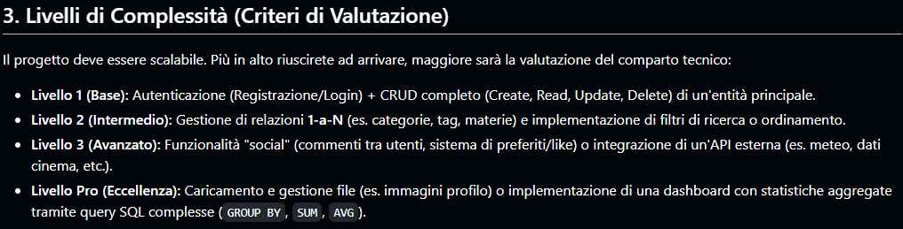

# 🎄 Christmas Project – v2.0 Full Refresh
## 📘 PROJECT GUIDE

---

## Project Overview

Questo progetto è una **web application Flask** sviluppata come progetto di Natale. Rappresenta una **ricostruzione completa** della versione precedente, con un focus specifico su:

- organizzazione modulare del progetto
- separazione delle responsabilità
- esperienza utente (UX)
- uso corretto di Flask (Blueprint, static, templates)

Repository del progetto originale: https://github.com/LucaPontellini/Christmas-project.git

---

## Obiettivo del progetto

L’obiettivo iniziale è la realizzazione di una **homepage tematica stile “casino”**, caratterizzata da:

- layout cinematografico
- animazioni progressive
- musica di sottofondo
- struttura Flask pulita e scalabile

Questa homepage rappresenta il **punto di ingresso** dell’applicazione e costituisce la base visiva su cui verranno sviluppate le funzionalità backend.

Il progetto è pensato come base per una futura estensione:
- login
- giochi
- database
- funzionalità applicative complete

---

# Requisiti Tecnici e Livelli di Complessità

Il progetto è stato sviluppato seguendo i criteri ufficiali di valutazione per misurarne la **scalabilità**, la **qualità tecnica** e il livello di **maturità architetturale**.



# Stato Attuale del Progetto: **LIVELLO PRO**

Il progetto soddisfa pienamente i requisiti del livello **PRO**, grazie a:
- **CRUD Avanzato:** Gestione utenti con distinzione tra *Soft Delete* (disabilitazione) e *Hard Delete* (rimozione definitiva).
- **Logica Aggregata:** Dashboard amministrativa con calcolo in tempo reale di GGR (Gross Gaming Revenue), bilancio globale e altri KPI tramite query SQL aggregate.
- **Esperienza Asincrona:** Utilizzo della Fetch API per operazioni senza ricaricare la pagina (es. riscatto bonus).
- **Architettura Professionale:** Separazione netta tra:
  - **Repository** → gestione dati  
  - **Service** → logica applicativa  
  - **Routes** → controller e gestione endpoint  

# Stato del Comparto Tecnico

Il progetto copre interamente i livelli **Base** e **Intermedio**, con solide basi già pronte per il livello di eccellenza.

## Livello 1 (Base): Autenticazione & CRUD Completo ✅

- **Sistema Account:** Implementazione completa di Registrazione, Login e Logout.
- **Gestione Evoluta (CRUD):** Nel pannello Admin è possibile leggere la lista utenti, aggiornare i bilanci e gestire lo stato degli account.
- **Gestione Cancellazioni:** Implementata la distinzione tra:
  - *Soft Delete* → disabilitazione per mantenere l'integrità dei log  
  - *Hard Delete* → rimozione definitiva

## Livello 2 (Intermedio): Relazioni e Log ✅

- **Struttura 1-a-N:** Il database è progettato per collegare ogni utente a molteplici eventi come transazioni, bonus e accessi.
- **Monitoraggio:** La sezione *System Activity* registra in tempo reale ogni accesso al sistema, gestendo correttamente lo storico per singolo utente.

## Livello 3 (Avanzato): Asincronismo e API ⚠️

- **Esperienza Utente:** Utilizzo di JavaScript (Fetch API) per il sistema di riscatto bonus, permettendo l'aggiornamento dei dati senza ricaricare la pagina.
- **Interazione Backend:** Comunicazione asincrona tra frontend e rotte Flask per una gestione fluida della UI.

## Livello PRO (Eccellenza): Dashboard & Query Complesse ⚠️

- **Interfaccia Professionale:** Progettazione di una Global Dashboard per il monitoraggio dei KPI (Key Performance Indicators).
- **Statistiche Dinamiche:**  
  - Il contatore *Total Users* è già collegato a query SQL aggregate.  
  - Gli altri indicatori (*GGR*, *Chips Volume*, *Bonuses Issued*) sono strutturalmente pronti per l'integrazione di query `SUM` e `AVG`.

## Tabella Riassuntiva dei Livelli di Complessità

| Livello | Nome | Stato | Descrizione Sintetica |
|--------|------|--------|------------------------|
| **1** | **Base – Autenticazione & CRUD** | ✅ Completato | Sistema account completo, CRUD utenti, Soft/Hard Delete. |
| **2** | **Intermedio – Relazioni & Log** | ✅ Completato | Struttura 1‑a‑N, log accessi, storico attività utenti. |
| **3** | **Avanzato – Asincronismo & API** | ⚠️ Parzialmente | Fetch API per bonus, UI dinamica, interazione asincrona. |
| **PRO** | **Eccellenza – Dashboard & Query Aggregate** | ⚠️ In sviluppo | KPI dinamici, GGR, statistiche aggregate, dashboard professionale. |
---

## Struttura del progetto

La struttura del progetto segue il modello modulare visto in classe, basato su **Application Factory** e **Blueprint**.

```text
Christmas-Project-v2.0-Full-Refresh/
│
├── app/                                        # Cuore pulsante dell'applicazione Flask
│   ├── __init__.py                             # Application Factory: create_app()
│   │
│   ├── account/                                # Blueprint Gestione Utenti
│   │   ├── repository.py                       # Gestione Query SQL (CRUD, Soft/Hard Delete, PIN, Balance)
│   │   ├── routes.py                           # Gestione Endpoints (Login, Register, Logout, Reset Password)
│   │   └── services.py                         # Logica di supporto (Generazione e scadenza PIN di reset)
│   │
│   ├── admin/                                  # Blueprint Pannello Amministratore
│   │   ├── repository.py                       # Logica Dati: Statistiche dashboard (GGR, Chips, Users), Liste transazioni/accessi e azioni su utenti.
│   │   └── routes.py                           # Endpoints: Dashboard (/admin/dashboard), Gestione Bilancio, Soft/Hard Delete e Restore utenti con protezione admin_required.
│   │
│   ├── bonus/
│   │   ├── __init__.py                         # Blueprint Sistema Bonus
│   │   ├── repository.py                       # Query atomiche: Riscatto bonus, aggiornamento balance e inserimento automatico in transactions.
│   │   ├── routes.py                           # API Endpoint (/bonus/claim): Gestione risposte JSON per chiamate asincrone (Fetch API).
│   │   └── services.py                         # Business Logic: Validazione univocità del bonus e distinzione tra metodi 'classic' e 'spid'.
│   │
│   ├── casino/                                 # Blueprint Core Casino
│   │   ├── __init__.py                         # Inizializzazione Blueprint
│   │   └── routes.py                           # Punto centrale: Gestione Lobby, Logica Bonus visivi e placeholder per Giochi/Cassiere.
│   │
│   ├── database/                               # Infrastruttura Dati
│   │   ├── __init__.py                         # Inizializzazione Blueprint
│   │   ├── db.py                               # Gestione connessione SQLite: Factory, RowFactory e wrapper per query (one, all, execute, many).
│   │   ├── schema.sql                          # Definizione tabelle: Utenti, Bonus, Transazioni, Fiches e Log con logica di cancellazione a cascata.
│   │   └── er_diagram.md                       # Documentazione visiva delle relazioni tra entità del database (Entity-Relationship Diagram).
│   │
│   ├── main/                                   # Blueprint Landing Page
│   │   ├── __init__.py                         # Inizializzazione Blueprint
│   │   └── routes.py                           # Punto di ingresso: Gestione della rotta principale (/) e rendering della Landing Page (index.html).
│   │
│   ├── static/
│   │   ├── css/                                # Fogli di stile modulari (Separation of Concerns)
│   │   │   ├── base.css                        # Reset, variabili globali e skeleton del layout
│   │   │   ├── bonus_section.css               # Design specifico per la sezione riscatto bonus
│   │   │   ├── bonus.css                       # Stile delle promo cards e hero section bonus
│   │   │   ├── cashier.css                     # Layout ottimizzato per la cassa e i pagamenti
│   │   │   ├── casino.css                      # UI della lobby e gestione delle griglie giochi
│   │   │   ├── dashboard.css                   # Interfaccia Admin: statistiche e tabelle gestionali
│   │   │   ├── footer.css                      # Stile del piè di pagina globale
│   │   │   ├── game_card.css                   # Design atomico per le card dei singoli giochi
│   │   │   ├── index.css                       # Stile cinematografico per la landing page
│   │   │   ├── modals.css                      # Framework universale per le finestre popup
│   │   │   └── sidebar.css                     # Design della barra di navigazione laterale
│   │   │   
│   │   ├── js/
│   │   │   ├── auth_ui.js                      # Gestione dinamica dei form di Login/Register e validazione client-side
│   │   │   ├── bonus.js                        # Logica per il riscatto dei bonus tramite Fetch API (Livello 3)
│   │   │   ├── dashboard.js                    # Script dedicati alle interazioni del pannello Admin e grafici (Livello Pro)
│   │   │   ├── index.js                        # Gestione delle animazioni progressive e degli eventi della Landing Page
│   │   │   ├── modals.js                       # Controller universale per l'apertura/chiusura delle finestre modali
│   │   │   ├── music.js                        # Sistema di gestione audio (Persistenza, Volume, Play/Pause)
│   │   │   └── ui_toast.js                     # Sistema di notifiche popup (Toast) per feedback immediati di sistema
│   │   │
│   │   ├── images/
│   │   │   ├── games/                          # Cover per le card dei giochi (Injection dinamica)
│   │   │   │   ├── american_roulette.jpg       # Roulette Americana
│   │   │   │   ├── baccarat.jpg                # Baccarat
│   │   │   │   ├── big_six_wheel.png           # Ruota della Fortuna
│   │   │   │   ├── blackjack.jpg               # Blackjack
│   │   │   │   ├── caribbean_stud_poker.jpg    # Caribbean Stud Poker
│   │   │   │   ├── craps.jpg                   # Gioco dei dadi (Craps)
│   │   │   │   ├── deuces_wild.jpg             # Video Poker Deuces Wild
│   │   │   │   ├── dream_catcher.jpg           # Special: Dream Catcher
│   │   │   │   ├── e_sports.jpg                # Sezione E-Sports
│   │   │   │   ├── fantasy_sports.jpg          # Fantasy Sports
│   │   │   │   ├── french_roulette.jpg         # Roulette Francese
│   │   │   │   ├── greyhound_racing.jpg        # Corse dei levrieri virtuali
│   │   │   │   ├── horse_racing.jpg            # Corse dei cavalli virtuali
│   │   │   │   ├── jacks_or_better.jpg         # Video Poker Jacks or Better
│   │   │   │   ├── joker_poker.jpg             # Video Poker Joker Poker
│   │   │   │   ├── keno.jpg                    # Keno / Lotteria
│   │   │   │   ├── let_it_ride.jpg             # Let It Ride Poker
│   │   │   │   ├── mini_baccarat.jpg           # Mini Baccarat
│   │   │   │   ├── pai_gow_poker.jpg           # Pai Gow Poker
│   │   │   │   ├── poker_texas_holdem.jpg      # Texas Hold'em
│   │   │   │   ├── progressive_slot.jpg        # Slot con Jackpot progressivo
│   │   │   │   ├── punto_banco.jpg             # Punto Banco
│   │   │   │   ├── red_dog.jpg                 # Red Dog Card Game
│   │   │   │   ├── roulette.jpg                # Roulette (Generico)
│   │   │   │   ├── sic_bo.png                  # Gioco dei dadi Sic Bo
│   │   │   │   ├── three_card_poker.jpg        # Three Card Poker
│   │   │   │   ├── video_poker.jpg             # Video Poker (Generico)
│   │   │   │   ├── video_slot.jpg              # Video Slot Moderne
│   │   │   │   ├── virtual_sports.jpg          # Sport Virtuali
│   │   │   │   └── war.jpg                     # Casino War
│   │   │   │
│   │   │   ├── payments/                       # Gateway di Pagamento (UI Cashier)
│   │   │   │   ├── AmericanExpress.png         # Circuito American Express
│   │   │   │   ├── ApplePay.png                # Apple Pay
│   │   │   │   ├── BankTransfer.png            # Bonifico Bancario
│   │   │   │   ├── ecoPayz.png                 # ecoPayz
│   │   │   │   ├── GooglePay.png               # Google Pay
│   │   │   │   ├── Maestro.png                 # Circuito Maestro
│   │   │   │   ├── MasterCard.png              # Circuito MasterCard
│   │   │   │   ├── neteller.png                # Neteller
│   │   │   │   ├── PayPal.png                  # PayPal
│   │   │   │   ├── paysafecard.png             # Paysafecard
│   │   │   │   ├── postepay.png                # Postep
│   │   │   │   ├── Skrill.png                  # Skrill / Wallet
│   │   │   │   ├── Sofort.png                  # Sofort Banking
│   │   │   │   ├── Trustly.png                 # Trustly
│   │   │   │   └── VISA.png                    # Circuito Visa
│   │   │   │
│   │   │   ├── 18+.png                         # Badge gioco responsabile
│   │   │   ├── ADM.png                         # Logo Agenzia Dogane e Monopoli
│   │   │   ├── cashier.webp                    # Header sezione cassa
│   │   │   ├── casino_photos.jpg               # Hero image della lobby
│   │   │   ├── eCOGRA.png                      # Logo eCOGRA (Fair Play)
│   │   │   ├── eye_closed.png                  # Icona visibilità password disabilitata
│   │   │   ├── eye_open.png                    # Icona visibilità password abilitata
│   │   │   ├── favicon.ico                     # Icona del browser
│   │   │   ├── GameCare.png                    # Logo GameCare (Gioco Responsabile)
│   │   │   ├── gift_icon.png                   # Icona regalo per i bonus
│   │   │   ├── github.jpeg                     # Social: GitHub link
│   │   │   ├── instagram.jpeg                  # Social: Instagram link
│   │   │   ├── lock_icon.png                   # Icona lucchetto (Sicurezza)
│   │   │   ├── Luca_Pontellini.png             # Foto personale
│   │   │   ├── monopoly_man.png                # Mascotte / Branding element
│   │   │   ├── SPID.png                        # Icona SPID per login digitale
│   │   │   ├── user_icon.png                   # Placeholder profilo utente
│   │   │   └── youtube.jpeg                    # Social: YouTube link
│   │   │
│   │   └── music/                              # Playlist Audio (Atmosfera Casino)
│   │       ├── Invisible_Cities.mp3            # Traccia dedicata alla Landing Page (index.html)
│   │       └── Jazzy_Smile.mp3                 # Traccia per Lobby e aree interne (Casino, Admin, etc.)
│   │
│   ├── templates/
│   │   ├── admin/
│   │   │   └── dashboard.html                  # Interfaccia amministrativa per il monitoraggio KPI e gestione utenti (Livello Pro)
│   │   │
│   │   ├── casino/
│   │   │   ├── partials/                       # Componenti atomici e frammenti riutilizzabili del frontend
│   │   │   │   ├── games/                      # Moduli di categoria che popolano dinamicamente la lobby
│   │   │   │   │   ├── card_games.html         # Catalogo giochi di carte (Blackjack, Poker, ecc.) gestito tramite componenti
│   │   │   │   │   ├── dice_table.html         # Layout dedicato ai giochi di dadi e tavoli da gioco classici
│   │   │   │   │   ├── lotteries.html          # Modulo per la gestione di estrazioni e lotterie istantanee
│   │   │   │   │   ├── roulette.html           # Sezione specifica per le diverse varianti di Roulette
│   │   │   │   │   ├── slots.html              # Griglia ottimizzata per il catalogo delle slot machine
│   │   │   │   │   ├── special_games.html      # Contenitore per giochi stagionali o eventi speciali (es. Natale)
│   │   │   │   │   └── sports.html             # Interfaccia per scommesse virtuali e simulazioni sportive
│   │   │   │   │
│   │   │   │   ├── bonus_section.html          # Logica di riscatto bonus integrata con Fetch API (Livello 3 asincrono)
│   │   │   │   ├── cashier.html                # Pannello utente per la gestione del bilancio (Depositi/Prelievi)
│   │   │   │   ├── flash_messages.html         # Sistema di notifiche dinamiche (Toast/Alert) per feedback utente
│   │   │   │   ├── footer.html                 # Piè di pagina standardizzato con link e copyright
│   │   │   │   ├── game_card.html              # Componente base "DRY" che genera la card grafica di ogni singolo gioco
│   │   │   │   ├── modals.html                 # Frammenti per finestre popup (Login, Register, Reset PIN)
│   │   │   │   └── sidebar.html                # Navigation bar laterale per l'accesso rapido alle sezioni del casinò
│   │   │   │
│   │   │   └── lobby.html                      # HUB centrale dell'applicazione: aggrega i moduli delle varie categorie
│   │   │
│   │   ├── main/
│   │   │   └── index.html                      # Landing page cinematografica: punto di ingresso dell'applicazione
│   │   │
│   │   ├── base.html                           # Skeleton HTML5 globale: carica metadati, CSS globali e script core
│   │   └── layout.html                         # Wrapper strutturale: definisce l'area Main Content e integra la Sidebar
│   │
│   └── utils/                                  # Funzioni Helper
│       ├── __init__.py                         # Inizializzazione Blueprint
│       ├── auth.py                             # Decoratori: Protezione rotte (@login_required, @admin_required)
│       ├── color.py                            # UI UX: Generazione deterministica di avatar (Colore + Iniziale)
│       └── security.py                         # Security: Generazione PIN e calcolo scadenze temporali
│
├── instance/                                   # Cartella dati locali esclusa dal file .gitignore assieme a database.db (Runtime)
│   └── database.db                             # Database SQLite reale (Generato dallo schema.sql)
│
├── run.py                                      # Entry point: Avvio del server Flask
│                                               # 1. Chiama setup_database() per garantire che le tabelle esistano (DDL).
│                                               # 2. Crea l'app tramite l'Application Factory (create_app).
│                                               # 3. Lancia il server in modalità Debug (Hot Reload attivo).
│
├── setup_db.py                                 # Script di setup: Bootstrap del database
│                                               # 1. Crea la cartella /instance se mancante.
│                                               # 2. Esegue schema.sql per generare le tabelle (solo al primo avvio).
│                                               # 3. Crea l'account 'admin' (password: admin123) se non esiste già.
│                                               # 4. Usa generate_password_hash per garantire la sicurezza sin dall'inizio.
│
├── requirements.txt                            # Gestione Dipendenze
│                                               # - Flask: Il framework core per il web serving e il routing.
│                                               # - Werkzeug: Gestisce la sicurezza (password hashing) e il WSGI.
│                                               
├── LICENSE                                     # Licenza MIT: Uso libero, obbligo di citazione
│                                               # - Garantisce il mio copyright.
│                                               # - Permette a chiunque di usare, copiare e modificare il codice.
│                                               # - Esclude la responsabilità (Disclaimer "AS IS").
│
├── .gitignore                                  # Sicurezza e Pulizia: Esclusione file runtime
│                                               # - Protegge i dati sensibili (instance/, .env).
├── .env                                        # Variabili d'ambiente (es. SECRET_KEY, DATABASE_URL) - Escluso da .gitignore per sicurezza
│                                               # - Esclude file di sistema inutili (__pycache__, .vscode).
│                                               # - Mantiene il repository leggero e professionale.
│
├── PROJECT_GUIDE.md                            # Manuale tecnico: descrive il progetto in grandi linee, standard SoC e regole refactoring
│
├── README.md                                   # Il file che hai appena scritto (Presentazione)
│
└── docs_images/                                # Archivio immagini per la documentazione. Non viene utilizzato dall'applicazione
    ├── admin/                                  # Screenshot del pannello amministratore
    │   ├── account_management.JPG              # Gestione utenti: soft delete, restore, azioni amministrative
    │   ├── admin_dashboard_1.JPG               # Dashboard admin: KPI principali
    │   ├── admin_dashboard_2.JPG               # Dashboard admin: viste alternative e filtri
    │   ├── admin_dashboard.JPG                 # Dashboard amministratore (overview)
    │   ├── admin_logs.JPG                      # Log di sistema e tracciamento attività
    │   ├── hard_delete.JPG                     # Eliminazione definitiva account (hard delete)
    │   ├── recent_cash_flow.JPG                # Storico movimenti di cassa recenti
    │   ├── system_activity.JPG                 # Monitor attività globale del sistema
    │   ├── total_user_1.JPG                    # Statistiche utenti registrati (vista 1)
    │   └── total_user_2.JPG                    # Statistiche utenti registrati (vista 2)
    │
    ├── database/                               # Documentazione database e persistenza dati
    │   ├── database_1.JPG                      # Panoramica iniziale del database SQLite
    │   ├── database_2.JPG                      # Tabelle principali e relazioni
    │   ├── database_3.JPG                      # Bonus, transazioni e logiche economiche
    │   ├── database_4.JPG                      # Tabelle di log e auditing
    │   ├── database_5.JPG                      # Query, vincoli e foreign key
    │   ├── database_6.JPG                      # Schema completo finale del database
    │   ├── reset_pin.JPG                       # Flusso di reset PIN / password
    │   └── transactions.JPG                    # Storico completo delle transazioni
    │
    ├── forms/                                  # Interfacce dei form utente
    │   ├── form_login_1.JPG                    # Form di login: layout standard
    │   ├── form_login_2.JPG                    # Form di login: stato alternativo
    │   ├── form_login_3.GPG                    # Form di login: feedback visivo / stato finale              
    │   ├── form_recovery_1.JPG                 # Recupero password: inserimento dati
    │   ├── form_recovery_2.JPG                 # Recupero password: verifica PIN
    │   ├── form_registrazione_1.JPG            # Registrazione utente: step iniziale
    │   ├── form_registrazione_2.JPG            # Registrazione utente: validazione dati
    │   ├── form_registrazione_3.JPG            # Registrazione utente completata
    │   └── errors/                             # Stati di errore e validazioni UI
    │       ├── errore_form_login_1.JPG         # Errore: credenziali non valide
    │       ├── errore_form_login_2.JPG         # Errore: campi mancanti
    │       ├── errore_form_recovery_1.JPG      # Errore: utente non trovato
    │       ├── errore_form_recovery_2.JPG      # Errore: PIN non valido
    │       ├── errore_form_recovery_3.JPG      # Errore: PIN scaduto
    │       ├── errore_form_registrazione_1.JPG # Errore: username già esistente
    │       ├── errore_form_registrazione_2.JPG # Errore: password non conforme
    │       └── errore_form_registrazione_3.JPG # Errore: validazione generica
    │
    ├── lobby/                                  # Casino lobby e User Experience
    │   ├── delete_account.JPG                  # Eliminazione account lato utente
    │   ├── footer.JPG                          # Footer globale del sito
    │   ├── lobby_1.png                         # Lobby: vista generale
    │   ├── lobby_2.png                         # Lobby: categorie di gioco
    │   ├── lobby_3.png                         # Lobby: card dei giochi
    │   ├── lobby_4.png                         # Lobby: layout alternativo
    │   ├── lobby_5.png                         # Lobby: sezione bonus
    │   ├── lobby_6.png                         # Lobby: elenco giochi disponibili
    │   └── lobby_7.JPG                         # Lobby: UX finale completa
    │
    ├── others/                                 # Materiale di supporto e overview
    │   ├── imposed_difficulty_levels.png       # Riepilogo livelli di complessità tecnica raggiunti
    │   └── index.png                           # Landing page (index.html)
    │
    ├── outputs/                                # Output funzionali del sistema
    │   ├── output_tipico_1.JPG                 # Output tipico: operazioni utente
    │   ├── output_tipico_2.JPG                 # Output tipico: bonus
    │   ├── output_tipico_3.JPG                 # Output tipico: transazioni
    │   ├── output_tipico_4.JPG                 # Output tipico: dashboard admin
    │   ├── output_tipico_5.JPG                 # Output tipico: gestione errori
    │   ├── output_tipico_6.JPG                 # Output tipico: sicurezza
    │   ├── output_tipico_7.JPG                 # Output tipico: logging
    │   ├── output_tipico_8.JPG                 # Output tipico: flusso completo
    │   ├── output_tipico.JPG                   # Riepilogo output principali
    │   └── password_reset.JPG                  # Reset password avviato dal login
    │
    └── socials/                                # Branding & identità
        ├── lucapontellini.jpeg                 # Profilo Instagram personale
        ├── LucaPontellini.JPG                  # Profilo GitHub scolastico
        ├── plastici.f3rroviari.jpeg            # Profilo Instagram personale (secondo account)
        └── plastici.ferroviari.JPG             # Profilo YouTube personale (associato al secondo account Instagram)
```

---

## Architettura dell’applicazione

### Application Factory

L’applicazione Flask viene creata tramite una **Application Factory** (`create_app()`), che consente:

- migliore organizzazione del codice
- separazione delle configurazioni
- maggiore scalabilità
- facilità di test ed estensione

Il file `app/__init__.py` ha il compito di:
- inizializzare Flask
- registrare i Blueprint
- configurare l’applicazione

---

### Blueprint

La logica dell’applicazione è suddivisa in **Blueprint** per evitare un’app monolitica.

Attualmente è presente:
- `main` → gestione della homepage
- `casino` → gestione della lobby principale e navigazione interna

In futuro verranno aggiunti Blueprint dedicati a:
- autenticazione (`auth`)
- gestione delle entità
- funzionalità avanzate

---

## Gestione dei template

I template HTML sono organizzati nella cartella `templates/` e suddivisi per Blueprint.

- `templates/main/index.html`  
  Contiene la struttura HTML della homepage.

I template utilizzano **Jinja2**, permettendo:
- separazione tra logica e presentazione
- riutilizzo dei layout
- estensioni future (base layout, partial, ecc.)

---

## Gestione dei file statici

Tutte le risorse statiche sono centralizzate nella cartella `static/`, suddivise per tipologia:

- `css/` → stile dell’applicazione
- `js/` → logica frontend (animazioni, audio, interazioni)
- `images/` → immagini dell’interfaccia
- `music/` → musica di sottofondo

Questa organizzazione segue le best practice Flask e migliora la leggibilità e manutenzione del progetto.

---

## UI / UX & Responsive Design

Una parte centrale del progetto riguarda la **cura dell’esperienza utente (UX)** e dell’interfaccia grafica (UI).

La lobby del casino è stata progettata con particolare attenzione a:

- gerarchia visiva chiara
- call-to-action evidenti (Welcome Bonus, Play, Activate)
- coerenza cromatica (nero/oro stile casino)
- animazioni leggere e progressive

### Responsive Design

L’interfaccia è **completamente responsive**, con adattamenti specifici per dispositivi mobili:

- layout flessibile basato su Flexbox e Grid
- ridimensionamento di card, testi e pulsanti su smartphone
- gestione dedicata della sezione *Welcome Bonus* su mobile
- pulsanti full-width e spaziature maggiorate per touch

Le regole responsive sono gestite tramite **media queries** all’interno di `casino.css`, mantenendo separata la logica desktop da quella mobile.

---

## Database Design & Struttura Dati

Il sistema utilizza **SQLite** come motore di database. La progettazione segue i principi di integrità referenziale con gestione avanzata dei log e delle transazioni.

* **Schema SQL:** Il codice sorgente per la creazione delle tabelle è disponibile in [`app/database/schema.sql`](app/database/schema.sql).
* **Diagramma ER:** La rappresentazione visiva delle entità e delle relazioni (Entity-Relationship) è consultabile nel file [`app/database/er_diagram.md`](app/database/er_diagram.md).

---

## Filosofia del progetto

Il progetto non è pensato come un semplice esercizio, ma come una **base applicativa reale**, sviluppata seguendo:

- buone pratiche di sviluppo
- architettura modulare
- codice leggibile e manutenibile
- attenzione alla resa grafica e all’usabilità su dispositivi reali

Ogni funzionalità verrà aggiunta in modo incrementale, mantenendo la coerenza strutturale dell’applicazione.

---

# Cronologia dello Sviluppo e Note di Refactoring (v2.0)

Il passaggio alla versione **2.0** ha segnato una svolta fondamentale nell'evoluzione dell'applicazione.

---

## Ricostruzione Integrale
Il progetto è stato riscritto completamente da zero per risolvere problemi strutturali e concettuali che impedivano la scalabilità del codice.

---

## Nuovo Approccio Architetturale
I commit iniziali seguivano la struttura standard, ma si è reso necessario un cambio radicale di approccio per implementare correttamente la **separazione delle responsabilità (SoC)**.

---

## Stabilizzazione e Commit
La scelta di non effettuare commit intermedi è stata dettata dalla volontà di evitare versioni instabili, preferendo attendere il raggiungimento di una release solida e funzionante.

---

## Sintesi Creativa
Questa release stabile integra gli obiettivi prefissati per l’anno in corso, riprendendo e ottimizzando le migliori intuizioni del progetto di Natale precedente.

---

## Refactoring dei Contenuti
La logica Python è stata smontata e riorganizzata in più passaggi.  
Pur mantenendo le stesse variabili, questo metodo garantisce:

- maggiore leggibilità  
- manutenzione più semplice  
- struttura più coerente e scalabile  

---

## Guida Operativa del Progetto

Per chi desidera **utilizzare concretamente il progetto**, avviarlo in locale e comprenderne il flusso operativo passo-passo, è disponibile un file dedicato: **[`PROJECT_OPERATION.md`](PROJECT_OPERATION.md)**

Questo documento è concepito come un **tutorial pratico**, e include:
- istruzioni di setup e avvio dell’applicazione
- spiegazione dei flussi principali (login, admin, bonus, dashboard, ecc.)
- esempi di utilizzo delle funzionalità
- indicazioni per testare e sperimentare il progetto

Il presente file **`PROJECT_GUIDE.md`** ha invece lo scopo di fornire una **visione architetturale e concettuale** del progetto, descrivendone la struttura, le scelte tecniche e la filosofia di sviluppo.

**In sintesi**:
- **PROJECT_GUIDE.md** → *come è progettato il progetto*
- **PROJECT_OPERATION.md** → *come usare il progetto*

---

## Note finali

Il file **PROJECT_GUIDE.md** verrà aggiornato progressivamente per documentare le nuove funzionalità, le scelte progettuali e l’evoluzione architetturale del progetto.