# PROJECT_OPERATION.md
## Tutorial operativo – utilizzo del progetto (Christmas-Project-v2.0-Full-Refresh)

Questo file è un **tutorial operativo**. Non descrive l’architettura del progetto (quella è documentata in **[`PROJECT_GUIDE.md`](PROJECT_GUIDE.md)**). Qui trovi **solo cosa fare**, **in che ordine** e **cosa deve succedere**.

**Obiettivo finale:** aprire il browser e visualizzare la **landing page del casinò** e tutto il resto del progetto.

---

## Passo 1 – Scaricare il progetto

### Metodo consigliato (Git)

```bash
git clone https://github.com/LucaPontellini/Christmas-project.git
cd Christmas-project
```

Se il comando termina senza errori, il progetto è stato scaricato correttamente.

---

## Metodo manuale

1. Apri il browser e vai su https://github.com/LucaPontellini/Christmas-projec
2. Clicca su **Code → Download ZIP**
3. Estrai la cartella
4. Rinominala in `Christmas-project`
5. Apri il terminale dentro la cartella

---

## Passo 2 – Verificare Python

```bash
python --version
# oppure
python3 --version
```

È richiesta una versione 3.10 o superiore per utilizzare il progetto. Se Python non è installato vai su: https://www.python.org/downloads/

## Passo 3 – Creare l’ambiente virtuale
```bash
# Windows
python -m venv venv
venv\Scripts\activate
```

```bash
# macOS / Linux
python3 -m venv venv
source venv/bin/activate
```

Se compare **(venv)** (o in alcuni casi **.venv**) all’inizio della riga del prompt, l’ambiente virtuale è attivo.

## Passo 4 – Installare le dipendenze
```bash
pip install -r requirements.txt
```

Se il comando termina senza errori, le dipendenze sono state installate correttamente.

## Passo 5 – Avviare il server (database creato/aggiornato in automatico)

Basta eseguire questo unico comando:

```bash
python run.py
# oppure, su macOS / Linux
python3 run.py
```

## Cosa succede quando lo lanci

Il file run.py chiama automaticamente la funzione **setup_database()**. Se non esiste ancora, crea:

- la cartella instance/
- il file instance/database.db
- l’utente amministratore iniziale

Stampa nel terminale:

```bash
Database pronto
```

Poi avvia il server Flask di sviluppo.

---

## Output tipico che dovresti vedere
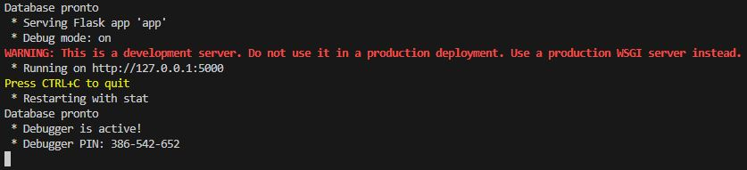

(Il Debugger PIN è casuale e diverso ogni volta. Le righe successive tipo GET / HTTP/1.1 200... appaiono quando apri la pagina nel browser.)

---

## Credenziali admin predefinite

- **username:** admin  
- **password:** admin123  
- **role:** admin  
- **avatar:** images/Luca_Pontellini.jpg  

> Nota: questi sono i valori di default creati dallo script **[`setup_db.py`](setup_db.py)**. Per vedere esattamente cosa viene impostato e dove, puoi aprire direttamente quel file.

---

## Passo 6 – Aprire il sito nel browser

Apri il tuo browser preferito e vai su:

- **Index del progetto** (prima pagina che si carica avviando l'app Flask): `http://127.0.0.1:5000/`

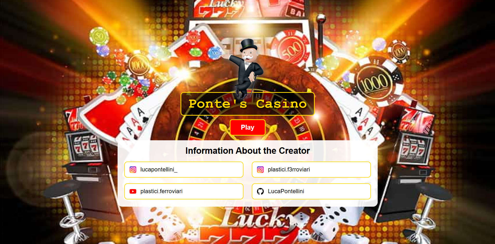

Se tutto è andato bene, vedrai la landing page con musica di sottofondo.
> Nota: per le regole di autoplay dei browser, la musica potrebbe partire solo dopo un clic sulla pagina.

## Informazioni personali (social media)

**Account Instagram personale**: [Instagram – lucapontellini_](https://instagram.com/lucapontellini_)  
---

**Account Instagram dedicato all’hobby dei plastici ferroviari (con mio babbo)**: [Instagram – plastici.f3rroviari](https://instagram.com/plastici.f3rroviari) 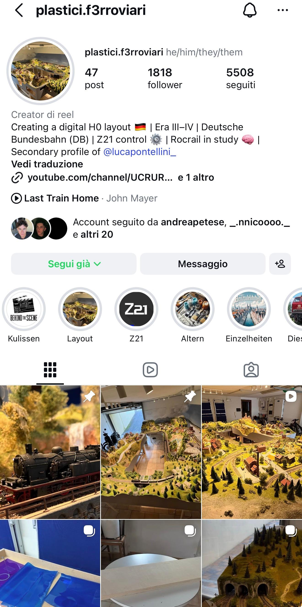
---

**Canale YouTube dedicato all’hobby dei plastici ferroviari**: [YouTube – plastici.ferroviari](https://youtube.com/@plastici.ferroviari) 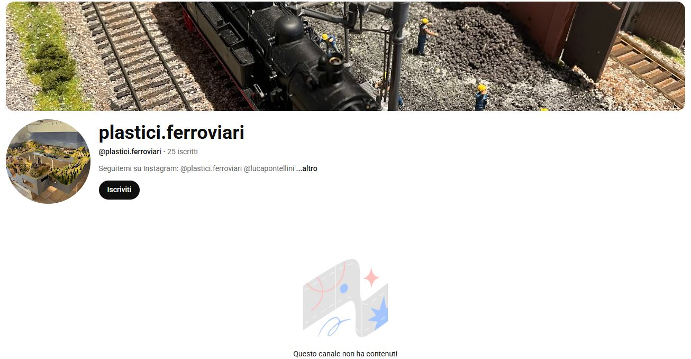
---

**Account GitHub scolastico**: [GitHub – LucaPontellini](https://github.com/LucaPontellini) 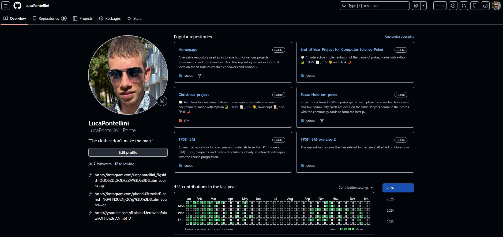
---

- **Lobby del casinò** (homepage del casinò): `http://127.0.0.1:5000/casino/`

# Descrizione Completa della Lobby (Homepage)

La pagina principale (lobby/homepage) del casinò presenta un layout con **navbar verticale fissa a sinistra** e area centrale scorrevole.

## Navbar Laterale Sinistra
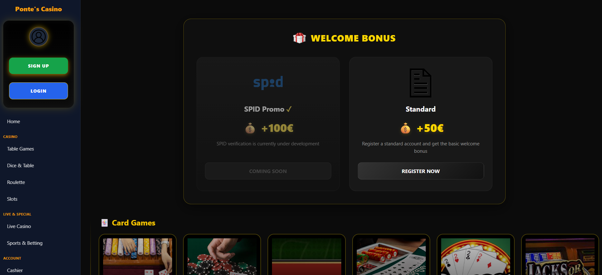

- In alto: nome del casinò **Ponte's Casino** in colore **arancione** prominente.
- Sotto il nome: **riquadro avatar utente**  
  - Icona di default: generica con sfondo grigio chiaro / semi-bluastro  
  - File: [`user_icon.png`](app/static/images/user_icon.png)
- Sotto l’avatar: pulsanti di azione  
  - **Registrazione (Sign Up)** → colore **verde acceso**  
  - **Login** → colore **blu acceso**
- L’intera zona utente (avatar + pulsanti) è racchiusa in un **rettangolo con bordi arrotondati**, sfondo **nero** e bordo **dorato** (tendenza giallo-grigio) per un effetto premium.
- Più in basso: **menu di navigazione principale**  
  - **Home** → torna all’inizio della pagina lobby  
  - **Table Games** → Giochi da tavolo  
  - **Dice & Table** → Giochi con dadi e tavoli correlati  
  - **Roulette** → Roulette (europea, francese, americana, ecc.)  
  - **Slots** → Slot machine (classiche a 3 rulli, video slot, progressive, ecc.)  
  - **Live Casino** → Casinò live con croupier reali in diretta streaming  
  - **Sports & Betting** → Scommesse sportive (calcio, tennis, basket, ecc.) e su corse di animali (cavalli, cani, ecc.)  
  - **Cashier** → Cassiere per depositi, prelievi e trasferimenti di denaro virtuale (solo utenti autenticati)

## Area Centrale della Pagina


- **In alto**: banner promozionale dei **bonus di benvenuto** per nuovi utenti  
  - Due blocchi affiancati:  
    - **Bonus SPID** → valore **€100**  
      - Immagine + testo descrittivo + importo  
      - Stato: **in sviluppo** → immagine **offuscata** (tono più scuro) + dicitura **"Coming soon"** *(traduzione: "Prossimamente")*  
    - **Bonus Standard** → valore **€50**
      - Immagine + testo descrittivo + importo  
      - Stato: attivo e visibile normalmente

- **Centro pagina**: sezione **giochi principali**  
  - Presentati in griglia o lista  
  - Al momento tutti in fase placeholder:  
    - Immagini segnaposto  
    - Sotto ciascuna: scritta **"Coming soon"** *(traduzione: "Prossimamente")*

- **Più in basso**: sezione **Cashier**  
  - Immagine segnaposto  
  - Sotto: scritta **"Coming soon"** *(traduzione: "Prossimamente")*

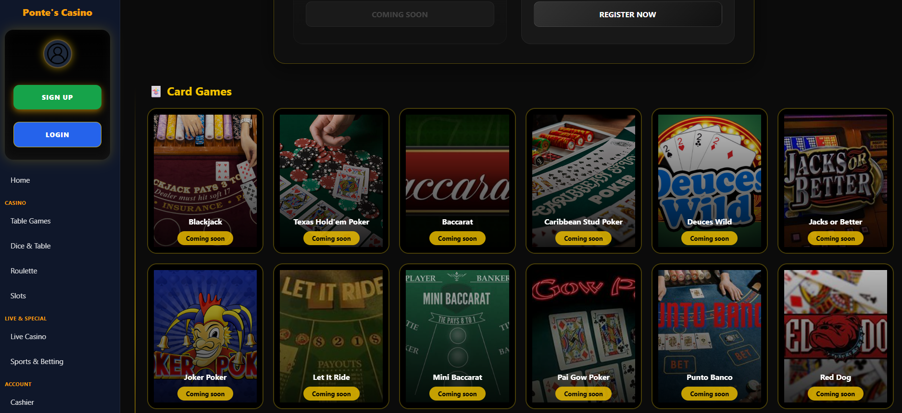  
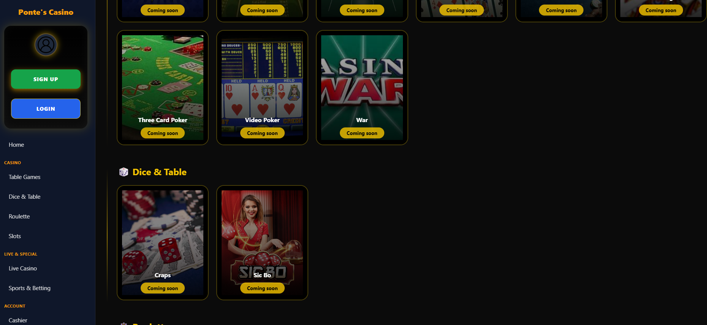  
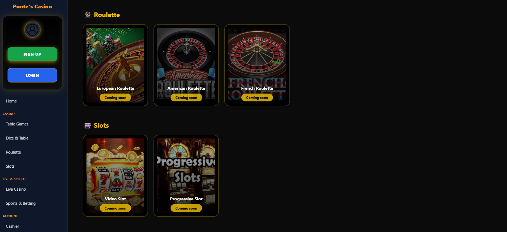  
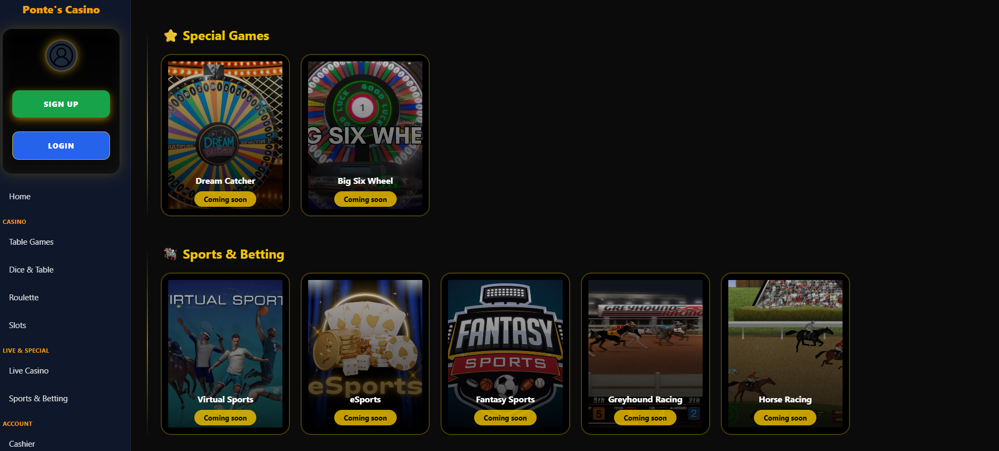  
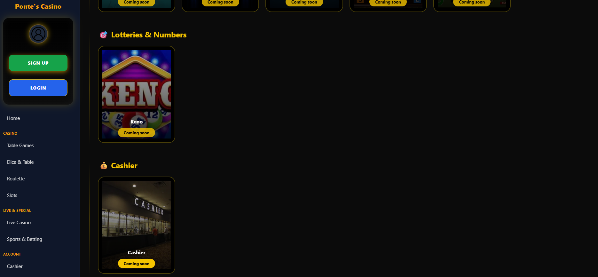

## Footer (in basso alla pagina) – Suddiviso in sezioni
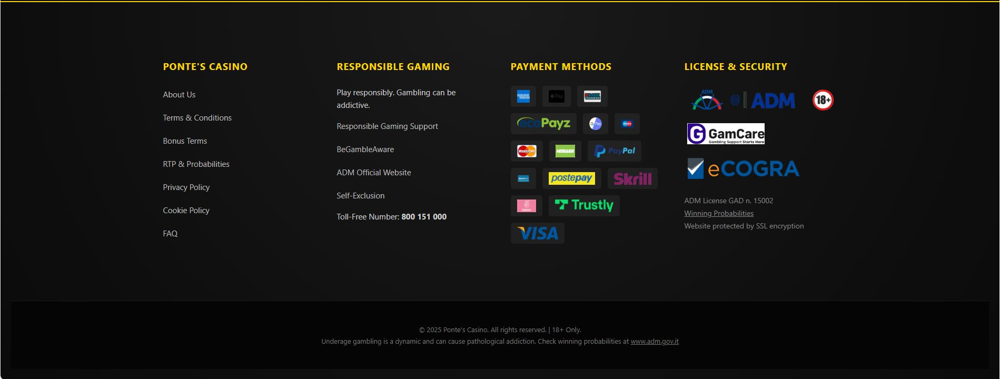

### 1. Ponte's Casino
- About Us → Chi siamo *(non ancora implementata)*  
- Terms & Conditions → Termini e condizioni *(non ancora implementata)*  
- Bonus Terms → Termini dei bonus *(non ancora implementata)*  
- RTP & Probabilities → RTP e probabilità *(non ancora implementata)*  
- Privacy Policy → Informativa sulla privacy *(non ancora implementata)*  
- Cookie Policy → Informativa sui cookie *(non ancora implementata)*  
- FAQ → Domande frequenti *(non ancora implementata)*

### 2. Responsible Gaming
- **Play responsibly. Gambling can be addictive.**  
  → **Gioca responsabilmente. Il gioco d’azzardo può creare dipendenza.**  
- Responsible Gaming Support → Supporto per il gioco responsabile  
- **BeGambleAware** → link esterno: https://www.begambleaware.org/  
- **ADM Official Website** → link esterno: https://www.adm.gov.it/  
- Self-Exclusion → Autoesclusione *(non ancora implementata)*  
- **Toll-Free Number**: 800 151 000 → Numero verde: 800 151 000

### 3. Payment Methods
Metodi accettati (mostrati come loghi):  
American Express, Apple Pay, Bank Transfer, ecoPayz, GooglePay, Maestro, MasterCard, Neteller, PayPal, Paysafecard, Postepay, Skrill, Sofort, Trustly, VISA

### 4. License & Security
- **ADM Logo** → link esterno: https://www.adm.gov.it/  
- **18+ Only** → logo/simbolo (solo per maggiorenni)  
- **GamCare** → link esterno: https://www.gamcare.org.uk/  
- **eCOGRA** → link esterno: https://www.ecogra.com/  
- **ADM License GAD n. 15002** → licenza fittizia  
- **Winning Probabilities** → Probabilità di vincita *(non ancora implementate)*  
- **Website protected by SSL encryption** → Sito protetto da crittografia SSL *(dichiarazione fittizia)*

### Blocco Copyright (chiusura footer)
© 2025 Ponte's Casino. All rights reserved. | 18+ Only.

Underage gambling is dangerous and can cause pathological addiction. Check winning probabilities at www.adm.gov.it

*(Traduzione: © 2025 Ponte's Casino. Tutti i diritti riservati. Riservato ai maggiorenni. Il gioco d’azzardo minorile è pericoloso e può causare dipendenza patologica. Consulta le probabilità di vincita su www.adm.gov.it. Cliccando sul link si viene reindirizzati al sito esterno adm.gov.it)*

---

Se tutto è andato bene, vedrai la homepage del casinò con musica di sottofondo.

> Nota: per le regole di autoplay dei browser, la musica potrebbe partire solo dopo un clic sulla pagina.

> I giochi del casinò e il cassiere (cashier) non sono ancora accessibili perché non sei autenticato appena entri sulla lobby (questa sarebbe la logica applicativa del progetto).

---

## Nota fondamentale sulla homepage del casinò
- Sia i giochi del casinò che il cassiere (cashier) non sono stati ancora implementati.
- Sono presenti solo come segnaposto per future implementazioni.
- Cliccandoci sopra non succede nulla.
- Non sono accessibili nemmeno dopo la registrazione e il login.
- Per questo si legge "Coming soon" *("Prossimamente")* sotto ogni immagine segnaposto.

---

- **Form di registrazione**: `http://127.0.0.1:5000/casino/`

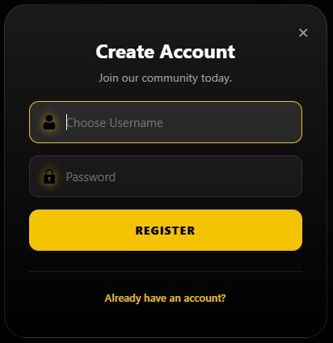

Caratteristiche:

- **accetta qualsiasi nome utente non già esistente nel database** (nel campo username)
- la **password** deve avere **almeno 6 caratteri** (nel campo password)
- una volta inserita la password, compare sulla destra un'icona a forma di occhio che permette di mostrare/nascondere la password inserita cliccandoci sopra
- **entrambi i campi sono obbligatori**
- per inviare i dati, l'utente deve cliccare sul pulsante **"Register"**
- il form invia i dati con **metodo POST a `/account/register`**
- dopo la registrazione, **l'utente viene reindirizzato al form di login del casinò**
- il form di registrazione è accessibile cliccando sul pulsante **"Sign Up"** nella navbar laterale sinistra della homepage del casinò
- il form di registrazione appare in una finestra modale (popup) sopra la homepage del casinò offuscando lo sfondo della pagina principale con un overlay scuro semi-trasparente
- il form di registrazione **può essere chiuso cliccando sulla "X"** in alto a destra del form o cliccando fuori dal form (sull'overlay scuro)
- il form di registrazione è responsive e si adatta a diverse risoluzioni dello schermo, mantenendo una buona usabilità sia su desktop che su dispositivi mobili
- se l'utente clicca sul link **"Already have an account?"** sotto il pulsante di registrazione (Register), **viene reindirizzato al form di login** del casinò (è comodo per chi si è sbagliato e voleva fare il login invece della registrazione)

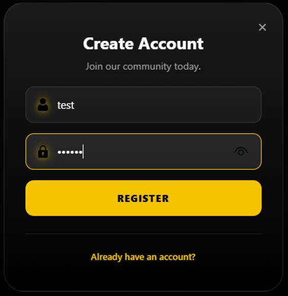
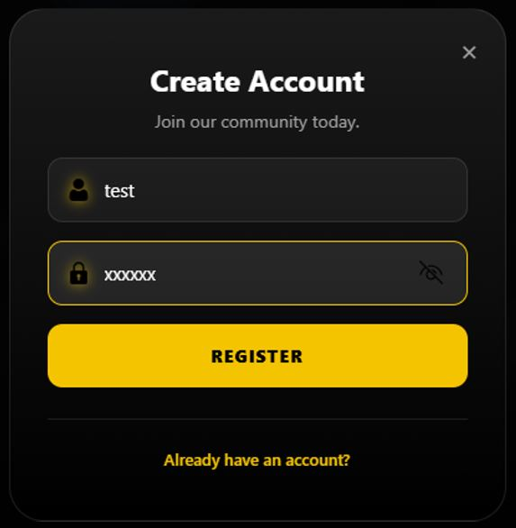

> Se si prova a registrarsi con un **username già esistente** oppure un **username già esistente**, ma che è stato **"soft deleted"** (*spiegazione delle eliminazioni più avanti nel file*) e/o una **password più corta di 6 caratteri**, compare un messaggio di errore sopra il form.

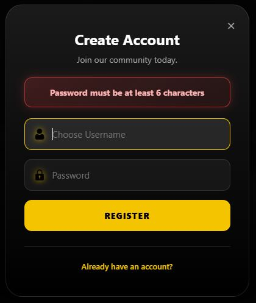
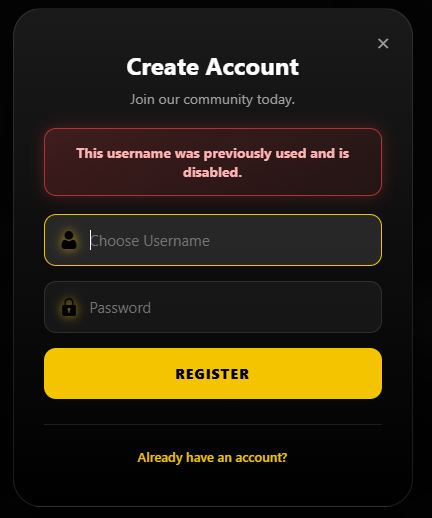
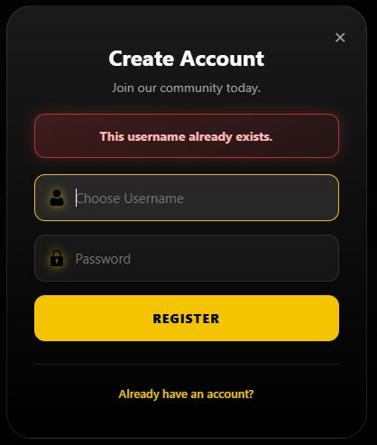

> Se la registrazione va a buon fine, si viene reindirizzati al form di login del casinò.

---

- **Form di login**: `http://127.0.0.1:5000/casino/`

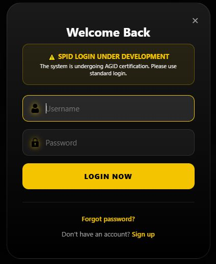

Caratteristiche:

- **accetta qualsiasi nome utente già esistente nel database** (nel campo username)
- la **password** deve avere **almeno 6 caratteri** (nel campo password)
- una volta inserita la password, compare sulla destra un'icona a forma di occhio che permette di mostrare/nascondere la password inserita cliccandoci sopra
- **entrambi i campi sono obbligatori**
- per inviare i dati, l'utente deve cliccare sul pulsante **"Login Now"**
- il form invia i dati con **metodo POST a `/account/login`**
- dopo la registrazione, **l'utente viene reindirizzato alla homepage del casinò** e il suo **avatar compare in alto a sinistra** nella navbar laterale **al posto dell'icona di default cambiando l'immagine di default (*user_icon.png*) con un cerchio colorato a seconda dell'iniziale del nome_utente scelto con la registrazione** (*maggiori informazioni sul file [`color.py`](app/utils/color.py)*)
- il form di login è accessibile cliccando sul pulsante **"Login"** nella navbar laterale sinistra della homepage del casinò
- il form di login appare in una finestra modale (popup) sopra la homepage del casinò offuscando lo sfondo della pagina principale con un overlay scuro semi-trasparente
- il form di login **può essere chiuso cliccando sulla "X"** in alto a destra del form o cliccando fuori dal form (sull'overlay scuro)
- il form di login è responsive e si adatta a diverse risoluzioni dello schermo, mantenendo una buona usabilità sia su desktop che su dispositivi mobili
- se l'utente clicca sul link **"Forgot password?"** sotto il pulsante di Login (Login Now), **viene reindirizzato al form di cambio password** del casinò (è comodo per chi ha dimenticato la password e vuole cambiarla)
- se l'utente clicca sul link **"Don't have an account? Sign Up"** sotto il pulsante di Forgot password (Forgot password?), **viene reindirizzato al form di registrazione** del casinò (è comodo per chi si è sbagliato e voleva fare la registrazione invece del login)
- è anche presente un riquadro informativo sotto al messaggio di benvenuto del form di login (*"Welcome Back"*) che ricorda all'utente di prestare attenzione al fatto che **il login con lo SPID non è stato ancora implementato** e che per ora può usare solo il **login standard** (il bonus SPID non verrà accreditato, ma solo quello standard da €50)

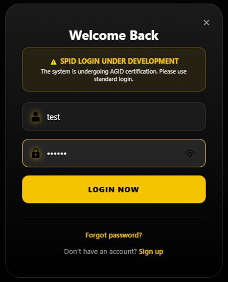
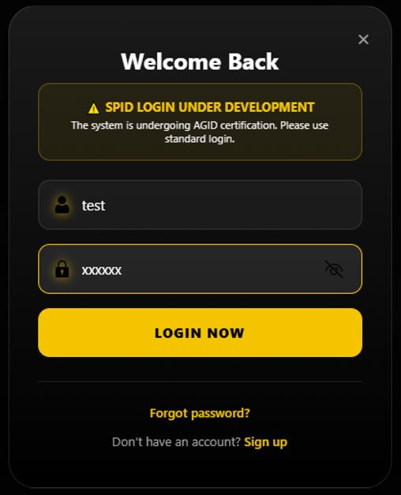

> Se si prova a loggarsi con un **username non esistente** oppure un **username già esistente**, ma che è stato **"soft deleted"** (*spiegazione delle eliminazioni più avanti nel file*) e/o una **password più corta di 6 caratteri**, compare un messaggio di errore sopra il form.

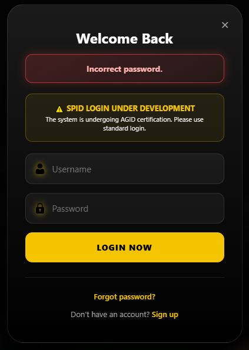
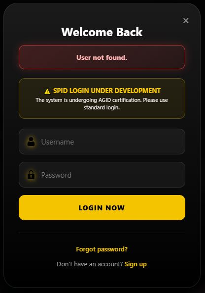

> Se la registrazione va a buon fine, si viene reindirizzati alla homepage del casinò.

---

- **Form di Recovery (cambio password)**: `http://127.0.0.1:5000/casino/`

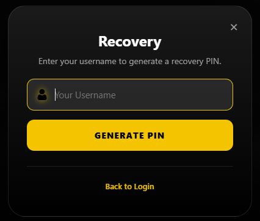

Caratteristiche:

- **accetta qualsiasi nome utente già esistente nel database** (nel campo username)
- per inviare i dati, l'utente deve cliccare sul pulsante **"Generate Pin"**
- il form invia i dati con **metodo POST a `/account/recover`**
- dopo aver inviato il form, se l'username esiste nel database, **viene generato un PIN di 6 cifre** (maggiori informazioni sul file [`security.py`](app/utils/security.py)) e **viene mostrato sopra il form** con un messaggio che dice che il PIN è: ... (*YOUR NEW PIN: XXXXXX*) e va usato nel form di cambio password, nel campo pin (*6-digit Recovery PIN*)
- se il **PIN viene inserito correttamente** nel form di cambio password, **l'utente può procedere a cambiare la password** (se dopo tutta la procedura del cambio password tutto va a buon fine, viene reindirizzato al form di login del casinò dove può inserire la nuova password per loggarsi)
- se il **PIN viene inserito in modo errato**, compare un **messaggio di errore sopra il form di cambio password (*Invalid PIN. A new one was generated.*)** e **viene generato un nuovo PIN di 6 cifre** che viene mostrato sopra il form facendo ripetere la procedura del cambio password (se dopo tutta la procedura del cambio password **l'utente non inserisce correttamente la nuova password come specificato sotto nelle istruzioni del form**, viene mostrato un **messaggio di errore** sopra il form di cambio password e **l'utente deve ripetere la procedura del cambio password dall'inizio**)
- se l'utente clicca sul link **"Back to Login"** sotto il pulsante di Update Password, **viene reindirizzato al form di login** del casinò (è comodo per chi si è sbagliato e voleva fare il login invece del cambio password)

> Errori del primo form di Recovery (username errato):

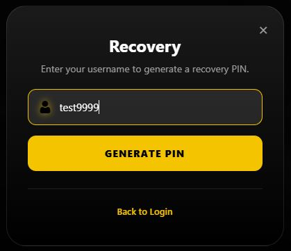
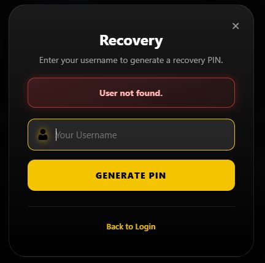

> Errori del secondo form di Recovery:

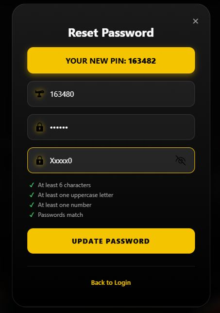
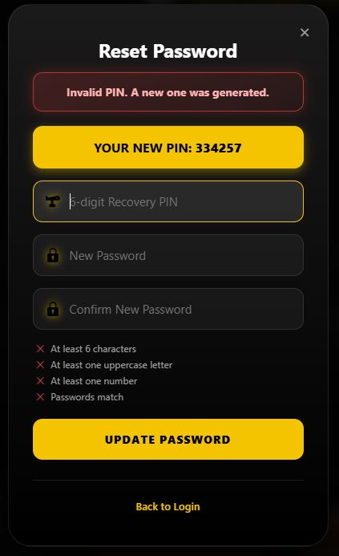

> gli errori indesiderati che si verificano in questo form al 100% (riguardante la parte del codice con cui si è sviluppato il form) sono: 
- non rispettando la regola dei 6 caratteri minimi per la nuova password che viene ignorata dal codice, ma fa procedere il cambio password con successo e riporta l'utente al form di login (quindi non è un errore bloccante, ma andrebbe sistemato in futuro)
- non rispettando la regola della lettera maiuscola (almeno una) che viene ignorata dal codice, ma fa procedere il cambio password con successo e riporta l'utente al form di login (quindi non è un errore bloccante, ma andrebbe sistemato in futuro)
- non rispettando la regola del numero (almeno uno) che viene ignorata dal codice, ma fa procedere il cambio password con successo e riporta l'utente al form di login (quindi non è un errore bloccante, ma andrebbe sistemato in futuro)

(le foto non le ho volute mettere perchè questi errori non bloccanti non mostrano messaggi di errore nel form, ma fanno procedere il cambio password con successo e riportano l'utente al form di login)

> Se il cambio password va a buon fine, si viene reindirizzati al form di login del casinò per loggarsi con la nuova password e con lo stesso username con cui si ha fatto il cambio password.

## Istruzioni del form di cambio password:
- il **PIN** deve essere composto da **6 cifre** e **deve corrispondere al PIN generato precedentemente dal programma** (nel campo pin)
- la **nuova password** deve avere **almeno 6 caratteri** (nel campo new_password), **almeno una lettera maiuscola** (nel campo new_password), **almeno un numero** (nel campo new_password) e **le due password devono coincidere** (nel campo confirm_password)
- **tutti i campi sono obbligatori**
- per inviare i dati, l'utente deve cliccare sul pulsante **"Update Password"**

--- 

- Cenno alla **Dashboard Admin** (admin dashboard):

Nel progetto sono presenti due tipi di utenti: standard e admin.

Gli **utenti con ruolo admin** hanno a disposizione un **pannello di amministrazione** accessibile tramite la voce **Admin Dashboard** nella navbar laterale.

Da qui **possono eseguire alcune operazioni privilegiate**, come monitorare le azioni degli utenti e i log delle operazioni critiche.

> Nota: la descrizione completa della dashboard e delle funzionalità admin viene fornita più avanti nel file, nella sezione dedicata. Seguendo il percorso passo passo, si capirà meglio la differenza tra i due tipi di utenti.

---

## Cosa succede poi?

Cambia la lobby (homepage del casinò):

- dopo essersi loggati, **i pulsanti di registrazione (Sign Up) e login scompaiono** dalla navbar laterale sinistra e **al loro posto compaiono i pulsanti di logout (Logout) e eliminazione dell'account (Delete account)** sotto l'avatar utente in alto a sinistra.
- **avviene, inoltre, l'aggiornamento ai bonus**: il **Balance viene aggiornato in base al tipo di bonus riscattato (SPID o Standard)** e di conseguenza **si aggiorna il riquadro dei bonus** stessi spiegando esplicitatamente che sono stati usati (**Bonus Processed + spunta**)

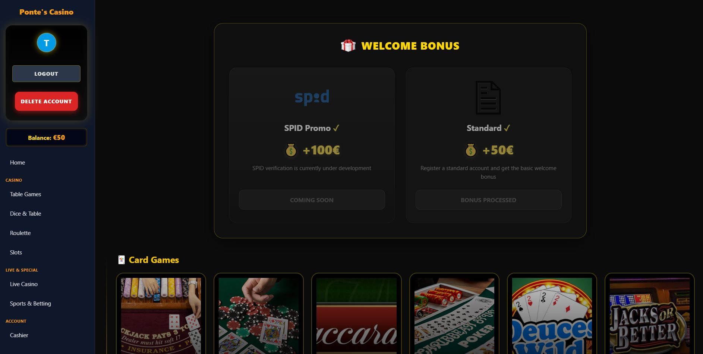

- premendo il **pulsante di logout (Logout)**, **l'utente viene disconnesso e reindirizzato alla homepage del casinò in modalità ospite (non autenticato)** dove i pulsanti di registrazione (Sign Up) e login ricompaiono nella navbar laterale sinistra al posto di quelli di logout (Logout) e eliminazione dell'account (Delete account).


- premendo il **pulsante di eliminazione dell'account (Delete account), compare un form** in cui l'utente può confermare l'eliminazione dell'account premendo il pulsante **"Yes, delete my account"** oppure annullare l'operazione premendo **"Cancel"**, la **"X"** in alto a destra del form o cliccando fuori dal form (sull'overlay scuro). 

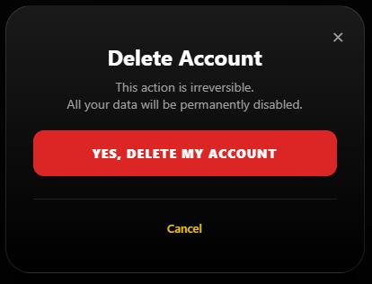

> **Se si procede all'eliminazione, l'utente viene disconnesso e reindirizzato alla homepage del casinò in modalità ospite (non autenticato)** dove i pulsanti di registrazione (Sign Up) e login ricompaiono nella navbar laterale sinistra al posto di quelli di logout (Logout) e eliminazione dell'account (Delete account).

> **Se non si procede, si resta loggati e si può navigare nel sito**

> IMPORTANTE: qualsiasi operazione effettuata da un qualsiasi utente viene tracciata e salvata nel database nel file **[`database.db`](instance/database.db)** che si trova nella cartella instance

---

## Cosa succede “dietro le quinte” del progetto?

Questa sezione descrive **cosa viene visualizzato nel terminale** e **come viene aggiornato il database** ogni volta che un utente interagisce con il sito: registrazione, login, logout, eliminazione account, cambio password. Include anche cosa cambia tra **utente normale e admin**.

1. Avvio dell’app:

Terminale:


> Nota: solo l’utente admin è presente all’avvio. Nessun altro utente né log esiste ancora.

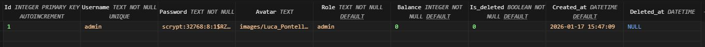

2. Apertura dell’index del progetto:

Quando apri l’index (http://127.0.0.1:5000/) nel browser, il terminale mostra richieste HTTP per caricare tutti i file statici (CSS, JS, immagini, musica, favicon).

Terminale:

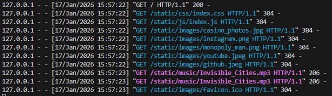

> Nota: Il server Flask risponde alle richieste dei file statici, caricando CSS, JS, immagini e musica. Il browser riceve le risorse e rende la pagina dell’index correttamente. Non viene effettuata nessuna scrittura sul database. Nessun utente viene creato o modificato. Ogni riga nel terminale indica una richiesta GET con il relativo file caricato e il codice di risposta HTTP:

- 200 → richiesta andata a buon fine
- 304 → file già presente nella cache del browser (non trasferito nuovamente)
- 206 → richiesta parziale per streaming (tipicamente musica o video)

3. Apertura della homepage del casinò:

Quando accedi alla homepage del casinò (http://127.0.0.1:5000/casino/), il terminale mostra tante richieste GET per caricare CSS, JS, immagini dei giochi, icone, musica e loghi dei metodi di pagamento.

Terminale:

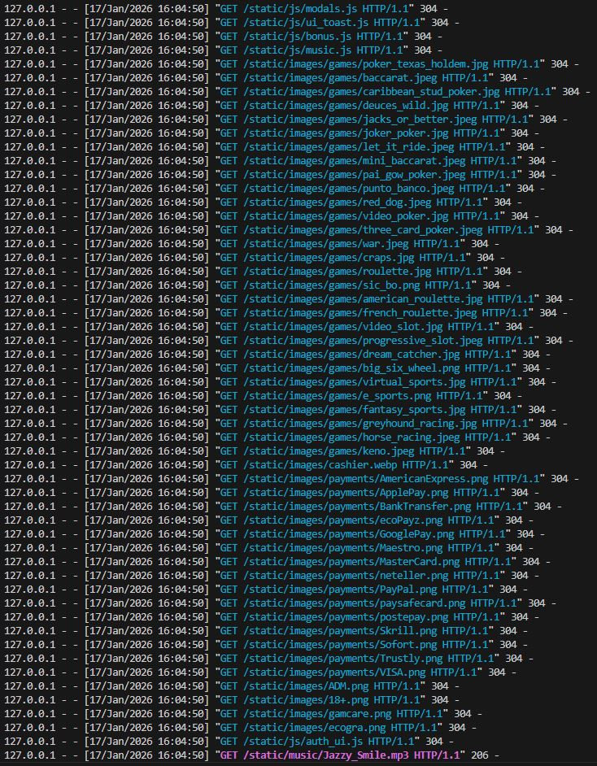

> Nota: Flask risponde alle richieste per tutti i file statici della pagina. Il browser riceve CSS, JS, immagini e musica, e li carica per costruire l’interfaccia della homepage. I giochi, bonus, avatar e loghi dei metodi di pagamento vengono caricati solo in lettura dal filesystem. Le risposte 304 indicano che il browser usa la cache e non scarica nuovamente il file. La musica viene servita con risposta 206 (parziale) per lo streaming. Il database non viene modificato: nessun utente viene creato o modificato, nessun bilancio cambia.

4. Registrazione di un nuovo account:

Quando un utente compila e invia il form di registrazione con dati validi, nel terminale compare qualcosa di simile a questo mostrato nel terminale di seguito.

Terminale:

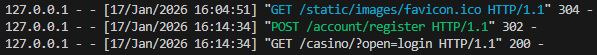

> Nota: Flask riceve la richiesta POST /account/register. Il backend crea l’account nel database con i seguenti valori di default:

- id: auto-incrementale
- username: quello inserito nel form
- password: hashata
- avatar: images/default_avatar.png
- role: user (utente normale, non admin)
- balance: 0
- is_deleted: 0
- created_at: data e ora correnti
- deleted_at: NULL

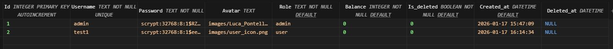

> Flask risponde con un redirect (302) alla pagina di login della lobby del casinò. Il database ora contiene il nuovo utente, senza modificare alcun altro record.

### Differenza tra utente normale e admin:

- **User normale**: può accedere al casinò, giocare, modificare il proprio account, ma non ha privilegi speciali.
- **Admin**: ha tutti i privilegi dell’utente normale più la possibilità di gestire utenti, bonus, giochi, ecc. (quello lo si analizzerà dopo nella sezione admin dedicata del file).

5. Login di un utente:

Quando un utente inserisce username e password corretti e clicca su Login Now, nel terminale compaiono righe simili a queste di seguito.

Terminale:

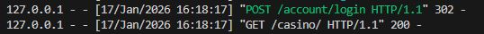

> Verifica credenziali:

- Flask recupera dal database l’utente con lo username inserito.
- Confronta la password hashata memorizzata con quella inserita.
- Se corrispondono, il login è considerato riuscito.

> Creazione della sessione:

Flask memorizza nella sessione:
- user_id
- username
- role
- avatar

> Nota: La sessione permette di riconoscere l’utente in tutte le pagine successive.

> Aggiornamento della homepage (lobby):

- I pulsanti di Sign Up e Login scompaiono dalla navbar.
- Appaiono Logout e Delete Account sotto l’avatar.
- Il riquadro dell’avatar cambia da icona di default a cerchio colorato o immagine personalizzata.
- Se l’utente ha bonus di benvenuto disponibili, il balance viene aggiornato e il frontend mostra Bonus Processed + spunta.

> Accesso alle risorse:

- Flask serve tutte le risorse necessarie alla pagina del casinò (CSS, JS, immagini, audio).
- Il terminale mostra tutte le richieste HTTP per ciascun file richiesto.

> Cosa succede nel database:

- Non viene modificato alcun dato al momento del login (salvo se il progetto prevede il tracciamento degli accessi o dei log utente, ad esempio registrando last_login).
- L’utente rimane attivo e i suoi dati (username, password hash, role, avatar, balance) restano invariati.
- Se ci fosse un log accessi, verrebbe aggiunto un record con timestamp e id utente, ma nel tuo output non ci sono modifiche visibili, quindi nel caso attuale il database non cambia.

> Differenza visibile lato utente:

- L’utente appena loggato vede subito la lobby personalizzata.
- I pulsanti della navbar cambiano dinamicamente.
- L’avatar mostra il cerchio colorato in base all’iniziale dello username.
- Bonus e balance vengono aggiornati in tempo reale.

6. Logout di un utente:

Quando un utente clicca su Logout, nel terminale compaiono righe simili a queste di seguito.

Terminale:

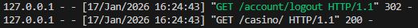

> Cancellazione della sessione:

Flask elimina tutti i dati salvati nella sessione dell’utente:

- user_id
- username
- role
- avatar

L’utente ora è considerato non autenticato.

> Reindirizzamento alla lobby pubblica:

- L’utente viene mandato alla pagina principale del casinò.
- Tutti i componenti che richiedono login (bonus personali, pulsanti Logout Delete Account, avatar personalizzato) vengono nascosti.

> Servizio delle risorse:

- Flask serve le risorse della homepage pubblica (CSS, JS, immagini, audio).
- Il terminale mostra tutte le richieste HTTP per ciascun file richiesto.

Cosa succede nel database:

- Non vengono modificate righe nel database.
- L’utente rimane registrato con tutti i suoi dati (username, password hash, role, avatar, balance, bonus).
- Se fosse presente il tracciamento accessi, verrebbe aggiunto un log di logout nella tabella Access_logs.

> Differenza visibile lato utente:

- I pulsanti di Logout e Delete Account scompaiono dalla navbar.
- Riappaiono i pulsanti di Sign Up e Login.
- L’avatar torna all’icona generica (cerchio con iniziale).
- L’utente non ha più accesso a bonus o contenuti riservati agli utenti autenticati.

7. Eliminazione account:

Quando un utente clicca su Elimina account, nel terminale compaiono righe simili a queste di seguito.

Terminale:

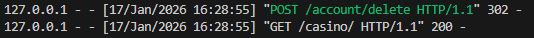

> Cancellazione della sessione:

- Flask elimina tutti i dati della sessione dell’utente (user_id, username, role, avatar).
- L’utente non è più autenticato.

> Soft delete nel database:

- L’utente non viene cancellato fisicamente dal database, ma viene impostato il flag deleted = 1.
- Questo permette di mantenere storico, saldo e bonus senza renderli più accessibili al front-end.

> Reindirizzamento alla lobby pubblica:

- Tutti i componenti riservati agli utenti registrati vengono nascosti.
- L’utente vede solo la homepage pubblica con pulsanti Sign Up e Login.

> Cosa succede nel database:

- La riga dell’utente viene aggiornata con deleted = 1.
- Tutti gli altri dati (username, password hash, avatar, balance, bonus) rimangono nel database.
- L’utente non può più accedere al proprio account fintanto che il flag rimane impostato.

> Differenza visibile lato utente

- L’utente scompare dal frontend come se non fosse mai esistito.
- Tutti i pulsanti personali (Logout, Delete Account, bonus personali) spariscono.
- Riappaiono i pulsanti di Sign Up e Login.
- L’utente non ha più accesso a bonus o contenuti riservati agli utenti registrati.

8. Cambio password – fase 1: richiesta PIN.

Quando un utente clicca su "Generate Pin", nel terminale compaiono queste righe di seguito.

Terminale:

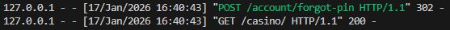

> Generazione e invio PIN:

- Flask genera un PIN casuale per il reset.
- Il PIN viene memorizzato nel database nella tabella pins associato all’utente.
- Un messaggio o flash alert può essere mostrato all’utente (lato frontend) per confermare che il PIN è stato inviato.

> Utente reindirizzato:

- Dopo la richiesta, l’utente viene reindirizzato alla pagina principale o al form di inserimento PIN.
- La sessione corrente resta invariata se l’utente è già loggato.

> Database:

Nella tabella pins appare una nuova riga:

- user_id: <id_utente>
- pin: <pin_generato>
- created_at: <timestamp>

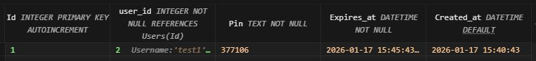

Nessun altro dato dell’utente viene modificato in questa fase.

9. Cambio password – fase 2: inserimento PIN e nuova password.

Quando l’utente inserisce il PIN ricevuto e la nuova password, nel terminale compaiono queste righe di seguito.

Terminale:

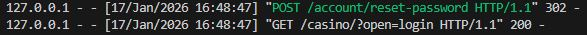

> Verifica PIN: 

- Flask controlla che il PIN inserito corrisponda a quello memorizzato nella tabella pins per quell’utente.
- Se il PIN è corretto e non scaduto, procede al reset della password.

> Aggiornamento password:

- La nuova password viene hashata e salvata nella tabella users al posto della vecchia password.
- Dopo il cambio, la riga della tabella pins relativa a quel PIN viene eliminata o marcata come usata, per motivi di sicurezza.

> Reindirizzamento:

- L’utente viene reindirizzato al login con un messaggio di conferma “Password aggiornata con successo”.
- Se il PIN fosse errato o scaduto, viene mostrato un errore e non si modifica nulla.

> Database:

Nella tabella users:

- id: <id_utente>
- username: <username>
- password: <nuovo_hash_password>
- ...

> Nella tabella pins: la riga relativa al PIN appena usato viene rimossa.

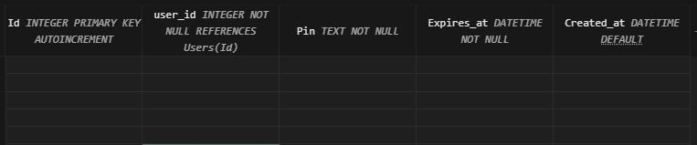

> Nota: le azioni vengono salvate in Admin_logs che servirà per la dashboard dell'admin...

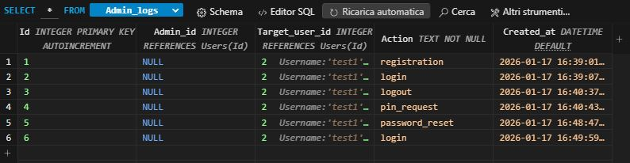

---

## Riassumendo:

> Operazioni di un utente standard (non admin) che vuole registrarsi, loggarsi e usare le funzionalità base del casinò:

1. Si apre l'index del progetto
2. Dopo tutte le animazioni, si clicca sul pulsante "Play"
3. Si apre la homepage del casinò (lobby):

- Si può navigare dentro la homepage del casinò
- Si possono vedere i giochi del casinò e il cassiere (cashier) come segnaposto (non ancora implementati), il menù di navigazione principale a sinistra, i bonus di benvenuto in alto e il footer in basso
- Se si desidera effettuare operazioni per avere un account si usano i form sotto l'icona utente

4. Si clicca sul pulsante "Sign Up" per aprire il form di registrazione
5. Si compila il form di registrazione e si inviano i dati
6. Se la registrazione va a buon fine, si viene reindirizzati al form di login del casinò
7. Si compila il form di login e si inviano i dati
8. Se il login va a buon fine, si viene reindirizzati alla homepage del casinò con l'utente loggato

- Se avvengono errori in uno qualsiasi dei form, compare un messaggio di errore sopra il form che spiega cosa non va e si deve ripetere la procedura del form
- Se si dimentica la password, si può usare il form di recovery (cambio password) accessibile dal form di login

9. Dopo essersi loggati, si può usare il pulsante di logout (Logout) e il form di eliminazione dell'account (Delete account) sotto l'avatar utente in alto a sinistra

> Operazioni di un utente admin che vuole registrarsi, loggarsi e usare le funzionalità base del casinò:

1. Si apre l'index del progetto
2. Dopo tutte le animazioni, si clicca sul pulsante "Play"
3. Si apre la homepage del casinò (lobby):

- Si può navigare dentro la homepage del casinò
- Si possono vedere i giochi del casinò e il cassiere (cashier) come segnaposto (non ancora implementati), il menù di navigazione principale a sinistra, i bonus di benvenuto in alto e il footer in basso
- Se si desidera effettuare operazioni per avere un account si usano i form sotto l'icona utente

4. Si clicca sul pulsante "Sign Up" per aprire il form di registrazione
5. Si compila il form di registrazione e si inviano i dati
6. Se la registrazione va a buon fine, si viene reindirizzati al form di login del casinò
7. Si compila il form di login e si inviano i dati
8. Se il login va a buon fine, si viene reindirizzati alla homepage del casinò con l'utente loggato

- Se avvengono errori in uno qualsiasi dei form, compare un messaggio di errore sopra il form che spiega cosa non va e si deve ripetere la procedura del form
- Se si dimentica la password, si può usare il form di recovery (cambio password) accessibile dal form di login

9. Dopo essersi loggati, si può usare il pulsante di logout (Logout) e il form di eliminazione dell'account (Delete account) sotto l'avatar utente in alto a sinistra

> Per l'admin, nel menù di navigazione a sinistra, compare una voce in più chiamata **"Admin Dashboard"** che permette di **accedere al pannello di amministrazione del casinò**

### Differenza tra utente normale e admin – lato operativo

| Aspetto | Utente normale | Admin |
|---------|----------------|-------|
| **Accesso alla homepage del casinò** | Sì | Sì |
| **Menu laterale** | Solo le voci standard: Home, Table Games, Dice & Table, Roulette, Slots, Live Casino, Sports & Betting, Cashier | Tutte le voci standard + **Admin Dashboard** |
| **Funzionalità** | Registrazione, login, logout, gestione account, bonus di benvenuto | Tutte le funzionalità dell’utente normale (tranne bonus personali) + gestione utenti, bonus (solo lato admin, non implementato per sé), giochi, log admin |
| **Tracciamento** | Sessione utente standard | Tutte le azioni registrate in `admin_logs` per monitorare operazioni di gestione |

> **Nota:** l’admin ha un ruolo speciale definito nel database (`role = 'admin'`). Questo viene controllato da Flask ogni volta che si accede alla dashboard o si tenta di eseguire un’azione riservata. L’admin **non riceve bonus**, ma può solo visualizzare o gestire quelli degli utenti.

---

## Stato delle tabelle del database

Questa sezione descrive le **tabelle presenti nel database** del progetto e il loro stato di utilizzo all'interno dell'applicazione.  
Non tutte le tabelle sono operative: alcune sono **predisposizioni per funzionalità future**, altre vengono utilizzate pienamente dal backend Flask.  

La tabella seguente mostra:

- ✅ **Usata**: la tabella è attiva e integrata nel flusso dell’app.
- ⚠️ **Parziale**: la tabella è presente, alcune funzionalità sono operative, altre no.
- ❌ **Non usata**: la tabella esiste nel database ma non è ancora utilizzata.

---

| Tabella                 | Stato                  | Note dettagliate                                                                                   |
|-------------------------|-----------------------|--------------------------------------------------------------------------------------------------|
| **Users**               | ✅ Usata               | Tutti gli utenti vengono creati, modificati e eliminati tramite soft delete. Gestisce username, password hash, avatar, ruolo, saldo e date di creazione/eliminazione. |
| **Password_reset_pins** | ⚠️ Parziale            | PIN per reset password presenti e collegati agli utenti. Alcune funzionalità non completamente operative. |
| **Chip_colors**         | ❌ Non usata           | Contiene i colori delle fiches per i giochi, ma attualmente non è integrata nel flusso dell’app. |
| **User_chips**          | ❌ Non usata           | Relazione N:N tra utenti e fiches, predisposta ma non utilizzata.                               |
| **Transactions**        | ✅ Usata           | Traccia movimenti economici (depositi, prelievi, vincite, perdite, bonus, manual_adj) all'interno della dashboard dell'admin |
| **Bonuses**             | ⚠️ Parziale            | Bonus "classic" assegnato agli utenti; bonus "spid" presente nel DB ma non attivo.              |
| **User_bonuses**        | ⚠️ Parziale            | Registra solo i bonus standard assegnati agli utenti; funzionalità avanzate non ancora operative. |
| **Access_logs**         | ⚠️ Parziale            | Predisposta per tracciare login/logout e attività sospette; alcune operazioni non scrivono dati. |
| **Admin_logs**          | ✅ Usata               | Tutte le azioni dell’admin (soft_delete, restore, hard_delete, ecc.) vengono registrate con timestamp. |

---

## Admin dashboard

### Passo per passo: accesso come admin alla dashboard

1. Apri il browser e vai all’index del progetto. Dopo aver fatto questo, accedere alla lobby del casinò:
```bash
http://127.0.0.1:5000/
```

```bash
http://127.0.0.1:5000/casino/
```

2. Apri il form di login cliccando sul pulsante Login nella navbar laterale sinistra.


Inserisci le credenziali dell’admin:

- Username: **admin**
- Password: **admin123**

(si possono trovare direttamente sul database nel file **[`database.db`](instance/database.db)**)


3. Invia i dati cliccando su **"Login Now"**.

Cosa succede nel terminale:

- Flask riceve la richiesta POST /account/login.
- Recupera l’utente admin dal database.
- Confronta la password hashata.
- Se corrisponde, la login viene considerata riuscita.
- Viene creata la sessione con: user_id, username, role = admin, avatar.

Cosa succede nel database:

- Nessuna modifica ai dati dell’admin.
- Viene eventualmente tracciata la sessione o il login (dipende dal tracciamento attivo).
- Aggiornamento della homepage del casinò (lobby):
- I pulsanti Sign Up e Login scompaiono.
- Appaiono Logout e Delete Account sotto l’avatar.
- L’avatar cambia da icona generica a immagine personalizzata (è rotonda perchè nel codice CSS si è ritagliata forzatamente).

 

4. Comparirà in più la voce **"Admin Dashboard"** nel menu laterale sinistro sottoforma di pulsante.

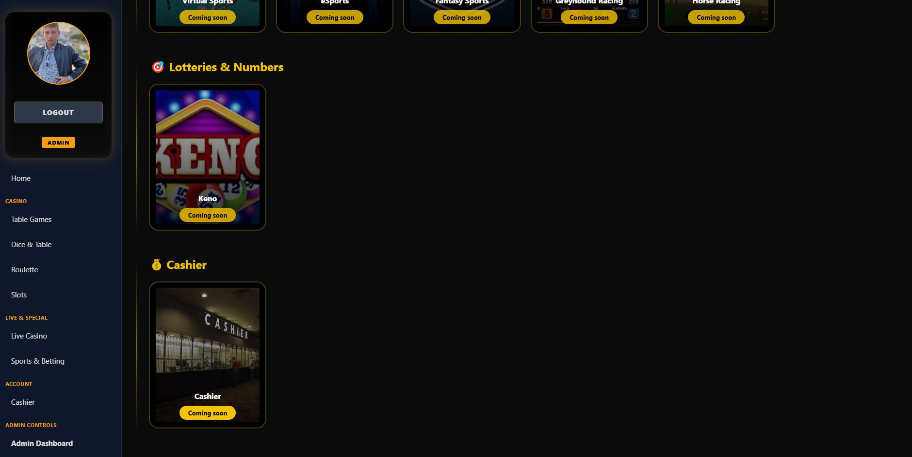 

5. Accesso alla dashboard:

- Cliccando sulla voce **"Admin Dashboard"**, l’admin accede al pannello di amministrazione.
- Qui può monitorare log, gestire utenti e altre operazioni privilegiate (descrizione dettagliata più avanti).

> Nota: l’utente normale non vede la voce "Admin Dashboard" e non può accedere al pannello.

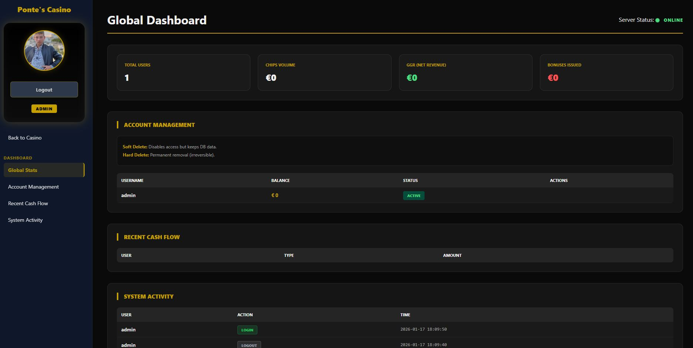
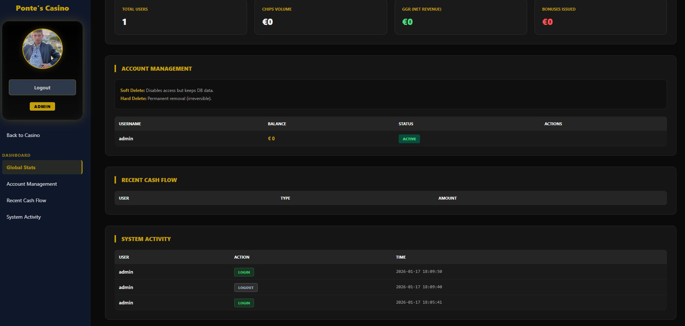 

# Panoramica Dashboard Admin  

**(Centro di controllo per amministratori del casinò online)**

La **Dashboard Admin** è il pannello di comando riservato agli utenti con ruolo **admin**.  
Si accede cliccando sulla voce **“Admin Dashboard”** presente nel menu laterale (sidebar) del sito.

È pensata per:

- vedere lo stato di salute economico del casinò in tempo reale  
- controllare e modificare gli account degli utenti  
- monitorare depositi, prelievi, vincite e perdite  
- vedere praticamente tutto quello che succede sulla piattaforma

---

## 1. Struttura generale

### Sidebar sinistra (menu laterale)

| Elemento               | Descrizione                                                                 | Colore / Stile principale          |
|-----------------------|-----------------------------------------------------------------------------|-------------------------------------|
| Sfondo                | Blu notte molto scuro                                                       | `#0f172a`                           |
| Logo casinò           | In alto                                                                     | —                                   |
| Avatar admin          | Foto profilo centrata con bordo                                             | bordo dorato `#c5a000`              |
| Badge                 | Scritta **ADMIN** sotto l’avatar                                            | testo dorato `#c5a000`              |
| Voce “Back to Casino” | Torna alla homepage pubblica (effettua anche logout)                       | —                                   |
| Gruppo **Dashboard**  | Contiene le 4 sezioni principali                                            | —                                   |
| Logout                | Pulsante in basso → chiude sessione e torna come ospite                    | —                                   |

**Comportamento al click su una voce del menu:**

- il link diventa **dorato (#c5a000)** e grassetto  
- la sezione corrispondente nell’area centrale riceve un **glow dorato temporaneo** (lampeggio leggero di 1–1.5 secondi)

### Area centrale

- Sfondo leggermente più chiaro rispetto alla sidebar  
  → `#1a1a1a`  
- In alto a sinistra: **titolo della sezione corrente**  
- In alto a destra: **Server Status** → sempre **ONLINE** con pallino verde che pulsa (effetto heartbeat)

---

## 2. Le quattro sezioni principali

### A. Global Stats  
**(Panoramica economica del casinò – vista dall’alto)**

Tipo: **4–6 schede rettangolari** disposte in griglia

| Statistica         | Cosa significa in parole semplici                                 | Colore / Stile tipico             |
|---------------------|-------------------------------------------------------------------|------------------------------------|
| Total Users         | Quante persone si sono registrate (totali)                        | bordo + titolo dorato              |
| Chips Volume        | Somma di tutti i soldi fittizi (chip) posseduti dagli utenti      | bordo + titolo dorato              |
| GGR (Net Revenue)   | Quanto ha guadagnato il casinò (ricavo netto)                     | bordo + titolo dorato              |
| Bonuses Issued      | Quanto valore di bonus è stato regalato agli utenti finora       | bordo + titolo dorato              |

Valori positivi → spesso in **verde chiaro**  
Valori che rappresentano “uscite” (bonus) → spesso in **rosso tenue**


> Nota: i valori Chips Volume, GGR (Net Revenue) e Bonuses Issued rimangono a €0 perchè non sono stati implementati. Di conseguenza rimangono a tale valore

> Nota: nel database si possono vedere in tempo reale gli utenti


---

### B. Account Management  
**(Gestione utenti – la sezione più usata dagli admin)**

**Tabella** con tutti gli utenti registrati

Colonne principali:

- **Username**
- **Balance** (saldo attuale in € o chip)
- **Status**  
  - Active → testo **verde**  
  - Disabled → testo **arancione**
- **Actions** (pulsanti per ogni riga)

**Pulsanti azioni disponibili:**

| Azione           | Cosa fa                                      | Colore pulsante       | Quando è visibile / attivo                     |
|------------------|----------------------------------------------|-----------------------|-------------------------------------------------|
| Soft Delete      | Disattiva account (blocca accesso)           | arancione `#f97316`   | solo se account attivo                          |
| Restore          | Riattiva account precedentemente disattivato | verde `#4ade80`       | solo se account disattivato                     |
| Hard Delete      | **Elimina definitivamente** l’utente         | rosso `#ff5252`       | modale di conferma obbligatoria                 |
| Adjust Balance   | Aggiunge o toglie saldo                      | + verde / – rosso     | campo numerico + pulsanti; validazione positiva |

**Regole di sicurezza importanti:**

- Non si può modificare / cancellare il proprio account admin  
- Non si possono cancellare altri account admin  
- Ogni azione viene registrata nella tabella `admin_logs`


> Nota: per eliminare gli utenti definitivamente (anche dal database) si usa questo form


> Il database si aggiorna automaticamente


---

### C. Recent Cash Flow  
**(Ultimi movimenti di denaro – depositi, prelievi, vincite, perdite)**

Tabella delle transazioni più recenti (di solito ultime 50–100)

Colonne tipiche:

- **User**
- **Type** → deposito / prelievo / vincita / perdita / bonus / rake / altro
- **Amount**

**Colorazione automatica:**

- Importi **positivi per il giocatore** (deposito, vincita, bonus ricevuto) → **verde**  
- Importi **negativi per il giocatore** (prelievo, perdita, bonus dato dal casinò) → **rosso**


> Nota: nel database si possono vedere in tempo reale le transazioni


---

### D. System Activity  
**(Log di tutto quello che succede – audit trail)**

Tabella con **tutte le azioni rilevanti** registrate dal sistema

Colonne:

- **User**
- **Action** (testo + tag colorato)
- **Time**

**Colori dei tag azione** (molto importanti per capire velocemente):

| Azione               | Colore tag principale     | Livello di attenzione |
|----------------------|---------------------------|-----------------------|
| HARD DELETE          | rosso forte               | ★★★ molto alto        |
| SOFT DELETE          | arancione                 | ★★ alto               |
| RESTORE              | verde                     | ★ medio               |
| BALANCE ADJUST       | ciano / azzurro           | ★★ alto               |
| REGISTRATION         | verde chiaro              | basso                 |
| LOGIN                | verde brillante           | basso                 |
| LOGOUT               | grigio                    | basso                 |
| SECURITY (pw reset)  | giallo                    | ★★ alto               |
| Altre azioni minori  | blu tenue                 | basso                 |

Le righe più critiche (hard delete, balance adjust, security) spesso hanno anche uno **sfondo leggermente più chiaro** o un piccolo glow al caricamento.


> Nota: tutto viene tracciato nel database tramite **"Admin_logs"**


---

## 3. Funzionalità & chicche che migliorano l’esperienza

- **Glow di transizione** quando si cambia sezione  
- **Server Status** sempre ONLINE con pallino verde che pulsa lentamente  
- **Flash messages** in alto (successo verde / errore rosso) che spariscono da soli  
- **Modale di conferma** obbligatoria per **Hard Delete**  
- Pulsanti **+ / –** del saldo si attivano solo se il valore inserito è valido  
- **Responsive**: su mobile la sidebar diventa menu hamburger o orizzontale  
- Animazioni leggere su pulsanti, tabelle e modali  
- Protezione automatica: non si possono modificare account admin

---

## 4. Riepilogo colori principali (da usare coerentemente)

## Riepilogo Color Palette Dashboard Admin

| Codice esadecimale | Nome / Descrizione comune     | Utilizzo principale nella dashboard                                      | Esempi concreti di elementi                                      |
|--------------------|-------------------------------|--------------------------------------------------------------------------|-------------------------------------------------------------------|
| `#0f172a`          | Blu notte molto scuro         | Sfondo principale della **sidebar** sinistra                             | Menu laterale, sfondo del menu                                    |
| `#1a1a1a`          | Grigio-nero scuro             | Sfondo dell’**area centrale** (contenuto principale)                     | Pannello principale, tabelle, schede                              |
| `#c5a000`          | Dorato / Oro                  | Elementi di **accento e stato attivo**                                   | Link selezionato, badge ADMIN, bordi schede Global Stats, glow    |
| `#f97316`          | Arancione acceso              | **Soft Delete**                                                          | Pulsante per disattivare account                                  |
| `#4ade80`          | Verde lime brillante          | **Restore**                                                              | Pulsante per riattivare account disattivato                       |
| `#ff5252`          | Rosso vivo / danger           | **Hard Delete**                                                          | Pulsante eliminazione permanente + modale conferma                |
| `#22c55e`          | Verde successo (verde chiaro) | Azioni positive, transazioni in entrata, status positivi                | Depositi, vincite, login, restore, messaggi di successo           |
| `#ef4444`          | Rosso pericolo                | Azioni negative, transazioni in uscita, errori                           | Prelievi, perdite, hard delete, messaggi di errore                |
| `#06b6d4`          | Ciano / Turchese              | **Balance Adjust** (modifiche manuali al saldo)                          | Tag BALANCE ADJ, icone modifica saldo                             |
| `#eab308`          | Giallo warning                | Azioni di **sicurezza** e attenzione                                     | SECURITY (reset password, pin), avvisi critici                    |
| `#10b981`          | Verde smeraldo scuro          | **Server Status ONLINE** + effetto heartbeat                             | Pallino lampeggiante “ONLINE”, indicatore server                  |

### Note sulle tonalità generiche (non fisse esadecimali)

- **verde**      → tipicamente `#22c55e` o `#4ade80` (Tailwind success-500 / success-400)
- **rosso**      → tipicamente `#ef4444` o `#f87171` (danger-500 / danger-400)
- **ciano**      → tipicamente `#06b6d4` o `#22d3ee` (cyan-500 / cyan-400)

### Esempio di uso del CSS

```css
:root {
  --sidebar-bg:        #0f172a;
  --main-bg:           #1a1a1a;
  --accent-gold:       #c5a000;
  --soft-delete:       #f97316;
  --restore:           #4ade80;
  --hard-delete:       #ff5252;
  --success:           #22c55e;
  --danger:            #ef4444;
  --balance-adjust:    #06b6d4;
  --security-warning:  #eab308;
  --online-pulse:      #10b981;
}
```

## File di riferimento della dashboard

- [`dashboard.html`](app/templates/admin/dashboard.html) 

Questo è il file HTML della dashboard. Contiene la struttura delle sezioni principali, la sidebar laterale, le tabelle, le schede statistiche e i pulsanti di azione. Gestisce anche i punti di ancoraggio per le varie sezioni cliccabili dal menu a sinistra.

- [`dashboard.css`](app/static/css/dashboard.css)

È il file CSS della dashboard. Definisce i colori, i font, le dimensioni, le bordature, le animazioni (glow, heartbeat, evidenziazioni) e la disposizione degli elementi. In pratica, controlla tutto l’aspetto visivo della dashboard.

- [`dashboard.js`](app/static/js/dashboard.js)

È il file JavaScript della dashboard. Gestisce l’interattività: click sui link della sidebar con scroll fluido e glow, abilitazione dei pulsanti di modifica saldo, apertura e chiusura della modale per l’hard delete, lampeggio del server status, e auto-hide dei messaggi flash.


## Comandi utili per l'utilizzo del software

Spegnere il server:
```bash
Ctrl + C
```

Riavviare il server:
```bash
python run.py
# Il database viene ricontrollato e, se necessario, ricreato.
```

Uscire dall’ambiente virtuale:  
```bash
deactivate
```

> Nota: se vuoi resettare completamente il database, chiudi il server, cancella il file instance/database.db e riavvia python run.py. Verrà ricreato da zero con l’utente admin.

---

## Problemi comuni e soluzioni

### Non parte niente / non vedi "Database pronto"

Controlla che l’ambiente virtuale sia attivo: devi vedere (venv) all’inizio della riga del prompt. Se non c’è, rientra con:

```bash
#Windows:  
venv\Scripts\activate
```

```bash
# macOS/Linux:  
source venv/bin/activate
```

---

### Errore "No module named flask" o simili

Reinstalla le dipendenze:
```bash  
pip install -r requirements.txt
```

---

### La musica non parte automaticamente

È normale: i browser bloccano l’autoplay. Clicca una volta sulla pagina (o sul pulsante play se presente) per sbloccare l’audio.

---

### Errore "Address already in use" (porta 5000 occupata)

Avvia il server su una porta diversa:
```bash  
python run.py --port 5001 # da 5001 in poi
```

Poi apri nel browser:
```bash
http://127.0.0.1:5001
```