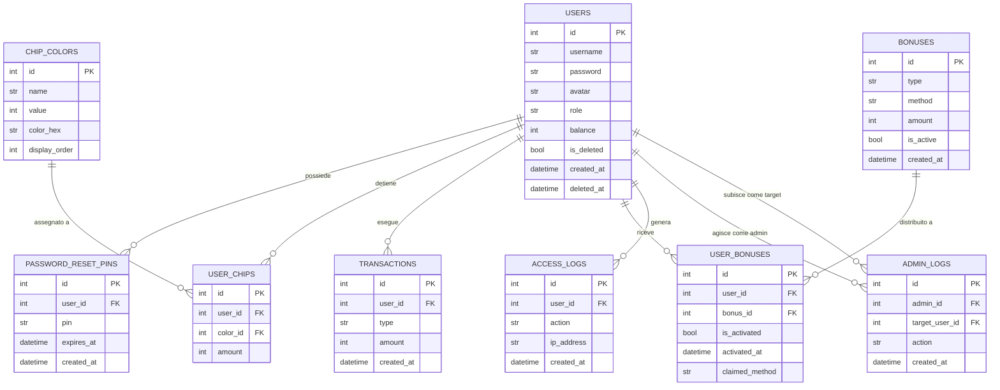

```mermaid
erDiagram

    USERS {
        int id PK
        str username
        str password
        str avatar
        str role
        int balance
        bool is_deleted
        datetime created_at
        datetime deleted_at
    }

    PASSWORD_RESET_PINS {
        int id PK
        int user_id FK
        str pin
        datetime expires_at
        datetime created_at
    }

    CHIP_COLORS {
        int id PK
        str name
        int value
        str color_hex
        int display_order
    }

    USER_CHIPS {
        int id PK
        int user_id FK
        int color_id FK
        int amount
    }

    TRANSACTIONS {
        int id PK
        int user_id FK
        str type
        int amount
        datetime created_at
    }

    BONUSES {
        int id PK
        str type
        str method
        int amount
        bool is_active
        datetime created_at
    }

    USER_BONUSES {
        int id PK
        int user_id FK
        int bonus_id FK
        bool is_activated
        datetime activated_at
        str claimed_method
    }

    ACCESS_LOGS {
        int id PK
        int user_id FK
        str action
        str ip_address
        datetime created_at
    }

    ADMIN_LOGS {
        int id PK
        int admin_id FK
        int target_user_id FK
        str action
        datetime created_at
    }

    USERS ||--o{ PASSWORD_RESET_PINS : "possiede"
    USERS ||--o{ USER_CHIPS : "detiene"
    USERS ||--o{ TRANSACTIONS : "esegue"
    USERS ||--o{ USER_BONUSES : "riceve"
    USERS ||--o{ ACCESS_LOGS : "genera"
    USERS ||--o{ ADMIN_LOGS : "agisce come admin"
    USERS ||--o{ ADMIN_LOGS : "subisce come target"
    CHIP_COLORS ||--o{ USER_CHIPS : "assegnato a"
    BONUSES ||--o{ USER_BONUSES : "distribuito a"
```